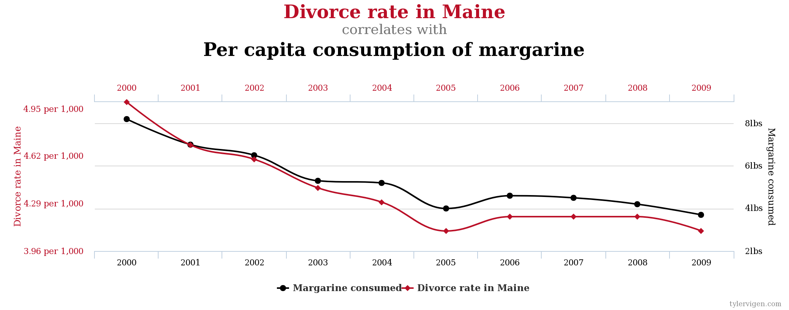
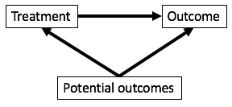

# What are causal effects?

## Slide credits

Much of the material draws upon or is adapted from [Elizabeth Stuart's](http://www.biostat.jhsph.edu/~estuart/index.html) slides from her [causal inference class](https://courseplus.jhu.edu/core/index.cfm/go/syl:syl.public.view/catalogID/23321)

## Correlation does not imply causation

[More fun with spurious correlations](http://tylervigen.com/spurious-correlations)

## Confounding

If we want to study the relationship between X and Y, we say that C is a confounder of the relationship between X and Y if C causes both X and Y.

## Thinking about causality

- Does smoking cause lung cancer?
- Alternatively, what is the effect of smoking on the risk of developing lung cancer? We have some cause, smoking, and want to know its effect on an outcome, the risk of developing lung cancer.
- One approach: obtain lung cancer rates in a set of people who smoke and in a set of people who do not smoke. What is wrong with this approach?

## Causal inference: goals of the field

- The field of causal inference is dedicated to developing and using methods to study causal effects.
- In particular, causal effects are the effect of a cause as opposed to the the cause of an effect
    - Cause of an effect: what causes lung cancer?
    - Effect of a cause: what is the effect of smoking on developing lung cancer?

## Ideal situation: observing parallel universes

- We would like to have a person who doesn't smoke and observe if he develops lung cancer and ideally compare to the same man in a parallel universe where he does smoke.
- Such a pair of outcomes is called a set of **potential outcomes**. The outcome in the parallel universe is called a **counterfactual outcome**.
- A framework for thinking about potential outcomes is detailed in the **Rubin causal model**.

## Rubin causal model

A framework for precise formulation of causal effects

- Treatment
- Units
- Potential outcomes

## Treatment

- Must be able to be administered as an **intervention**
- Non-examples:
    - BMI: "having a high BMI"
    - Sex: "being female"
    - Preferences: "liking Pepsi"
- Examples:
    - Weight loss program
    - Gender partial policies
    - Advertising campaigns for Pepsi

## Units

- Entities to which we can administer treatment or withhold treatment
- Units are also defined to be different at different times
    - For example, me right now is a different unit than me one hour from now

## Potential outcomes

Outcomes that could be observed for each unit under the different levels of the treatment (typically two levels):

$Y_i(0)$ is the **potential outcome** for study unit $i$ under the control condition.
$Y_i(1)$ is the **potential outcome** for study unit $i$ under the treatment condition.

If a study unit receives a particular level of the treatment (e.g. control) in real life, then the outcome under the other level of the treatment (e.g. treatment) is called the **counterfactual** outcome.

## Fundamental problem of causal inference

Example: viral load levels 5 days post-physician visit

 Units   $Y_i(1)$   $Y_i(0)$   $T_i$
------- ---------- ---------- -------
  1       30            ?        1
  2       ?            15        0
  .       .             .        .
  .       .             .        .
  N       22            ?        1

$T_i$ is the indicator of the treatment actually received.

## Causal effects (ideal)

What if we could observe study unit $i$ in both parallel universes? How might we compute the causal effect of treatment for this study unit?

$$ Y_i(1) - Y_i(0) $$

But we can't observe both of these!

## Typical causal effects estimated

Average treatment effect (ATE): average effect for everyone in the population

$$ ATE = \frac{1}{N}\sum_{i=1}^N (Y_i(1) - Y_i(0)) $$

Average treatment effect for the treated (ATT): average effect for only those treated

$$ ATT = \frac{1}{N}\sum_{i \in T} (Y_i(1) - Y_i(0)) $$

where $T$ is the set of people who received the treatment ($T_i = 1$)

## Examples: ATE and ATT

- Effect of heavy adolescent drug use on earnings at age 30
    - ATE: average effect of drug use on everyone, if everyone were forced to take drugs
    - ATT: average effect of drug use only on those who take drugs
- Effect of personalized tutoring on high school GPA
    - ATE: average effect of tutoring for everyone, if everyone were forced to get tutoring
    - ATT: average effect of tutoring only for those who obtain tutors

# How do we learn about causal effects?

## Key concepts

- Replication
- Stable Unit Treatment Value Assumption (SUTVA)
- Assignment mechanism

## Replication

- Collect data on multiple units where there is a mix of units receiving and not-receiving the treatment

## SUTVA

- If outcomes for one person could depend on someone else's treatment assignment, then the number of potential outcomes would explode
    - e.g. Person 1's potential outcomes would not only be for treatment and control but also for both given every possible combination of other individual's treatment assigments
- The Stable Unit Treatment Value Assumption (SUTVA) deals with this complication. It assumes:
    1. No interference between units: treatment assignment of one unit does not a↵ect potential outcomes of another unit
        - Drug use of one person doesn't affect someone else's outcomes
    2. Treatment only has one version
        - "Heavy" drug use doesn't have distinct subcategories such as "very heavy" or "moderately heavy"

## Assignment mechanism

- Process that determines which treatment each unit receives
- Randomized experiments
    - Known, clean assignment mechanism
- Observational studies
    - Have to guess an assignment mechanism
    - Have to propose an explanation for why certain individuals become heavy drug users

## Exercise: comparing two groups

"A large university is interested in investigating the effects on the students of the diet provided in the university dining halls and any sex differences in these effects. Various types of data are gathered. In particular, the weight of each student at the time of his arrival in September and his weight the following June are recorded." (Frederic Lord 1967, p. 304)

## Two statisticians

Statistician 1: No evidence of differential effect of diet between sexes

- Looks at the difference in mean weight changes between men and women
- Neither men nor women show a change in weight from September to June

Statistician 2: Diet has larger effect on men

- Uses regression to model June weight as a function of sex and September weight
- Holding September weight constant, men will weigh more in June on average

## Group work

The analysis done by both statisticians can be written as a regression model. Write down this model for both statisticians.

What is the treatment? What is the causal effect?

Which statistician's analysis is correct for determining the causal effect?

## Resolution

This study has no control! We are interested in the effect of university diet on weight - this is the treatment. Everyone in the study received the treatment!

The two statisticians aren't actually answering the main questions

- What is the causal effect of university diet on weight changes?
- Is this effect different in men and women?

This example is known as [Lord's paradox](https://en.wikipedia.org/wiki/Lord's_paradox).

Draw a table with columns: units, sex, Yi(1), and Yi(0). Yi(1) is filled in but Yi(0) is not.

## Analogy

A student wishes to study the impact of feeding coffee to his soybean plants. He has 5 plants and gives each of them 2 oz of coffee each night for 2 weeks. He records the plant heights before the experiment and after the two weeks. He concludes that coffee administration resulted in plants growing an average of 3.7 cm in the 2 weeks.

# Estimating causal effects: randomized trials

## Worrying about confounding {.build}

- Why is confounding a worry when trying to ascertain causal effects?
- Consider a situation where we want to know how effective a drug is at reducing viral load but people with less severe illness are more likely to obtain the drug than those with more severe illness.
- How is our estimate of drug efficacy affected?

## Randomized controlled trials

In RCTs, study units are randomly assigned to the treatment or control condition. What does this imply about the links in the causal diagram?

$$ P(T \mid X, Y(0), Y(1)) = P(T \mid X) $$

For this reason, RCTs are said to be the gold standard for assessing causal effects. However, RCTs are not so clean in real life (see later slides).

## Analyzing RCTs

- Regression analysis
- Tests for comparing means in two groups
- Permutation testing

## Regression analysis

$$ E[\mathrm{outcome}] = \beta_0 + \beta_T\mathrm{treatment} + \beta_1 x_1 + \cdots + \beta_p x_p $$

- With randomized trials, we expect no difference in $x_1, \ldots, x_p$ between the treatment arms.
- But there will still be some variation between the arms, and these predictors likely do help explain the outcome, so including them in the regression model is useful because we get a more refined estimate of the treatment effect.

## Comparing means

## Different types of RCTs

- Efficacy
- Effectiveness
- Pragmatic

## Efficacy trials

## Effectiveness trials

## Pragmatic trials

## Complications in RCTs

- Noncompliance
- Missing data
- Small sample sizes
- Interference between units
- Infeasible or unethical

## Interpretation of RCTs

- How representative was the study population of the target population?
- Does randomization itself change the nature of the effect being studied?
    - Is there a difference between being randomized to treatment vs. selecting the treatment?
- Does the implementation of the trial generalizable to standard practice?
    - How much skill is required in administering the treatment?
    - How much optimization is required of the treatment in the general population?

# Estimating causal effects: nonexperimental studies

## Types of nonexperimental studies

- Matching studies
    - As much as possible, replicate a randomized trial by comparing units that are as similar as possible other than the treatment
- Natural experiments
    - Take advantage of some chance event in life that affects who gets treatments
- Regression dicontinuity
    - Take advantage of some cutoff that determines who gets treated
- Interrupted time series
    - Take advantage of the introduction of a policy to compare outcomes before and after

## Matching methods

- Exact matching
- Propensity scores

## Exact matching

- For each treated individual, find a control who matches on all other covariates.
- Very difficult even with a moderate number of covariates

## Propensity scores

- Probability of receiving the treatment given the covariates

$$ \mathrm{Propensity\:score} = P(T_i = 1 | X_i) $$

- Want to match treated and untreated individuals with similar propensity scores
    - Given their characteristics, they had almost the same chance to receive the treatment
    - Almost as if the treatment were randomly assigned
    - At each value of the propensity score, treatment and control groups have the same distribution of each covariate

## Using propensity scores

- $k$-nearest neighbor matching
    - For each treated subject, find the $k$ controls with the closest propensity score
- Subclassification/stratification
    - Make a small number of groups where all units in a group fall into the same propensity score range
- Use propensity scores as weights

## Estimating propensity scores

- Any method for modeling the probability of a categorical event (treatment is usually binary)
- Logistic regression is most commonly used