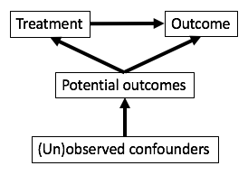

# Introduction to causal inference ideas

## Correlation does not imply causation

http://tylervigen.com/spurious-correlations

## Confounding

If we want to study the relationship between X and Y, we say that C is a confounder of the relationship between X and Y if C causes both X and Y.

## Thinking about causality

Does smoking cause lung cancer?

Alternatively, what is the effect of smoking on the risk of developing lung cancer? We have some cause, smoking, and want to know its effect on an outcome, the risk of developing lung cancer.

One approach: obtain lung cancer rates in a set of people who smoke and in a set of people who do not smoke. What is wrong with this approach?

## Ideal situation: observing parallel universes

We would like to have a person who doesn't smoke and observe if he develops lung cancer and ideally compare to the same man in a parallel universe where he does smoke. Such a pair of outcomes is called a set of **potential outcomes**. The outcome in the parallel universe is called a **counterfactual outcome**.

## Rubin causal model

A framework for precise formulation of causal effects

- Treatment
- Units
- Potential outcomes

## Treatment

- Must be able to be administered as an intervention
- Non-examples:
    - BMI: "having a high BMI"
    - Sex: "being female"
    - Preferences: "liking Pepsi"
- Examples:
    - Weight loss program
    - Gender partial policies
    - Advertising campaigns for Pepsi

## Units

- Entities to which we can administer treatment or withhold treatment
- Units are also defined to be different at different times
    - For example, me right now is a different unit than me one hour from now

## Potential outcomes

Outcomes that could be observed for each unit under the different levels of the treatment (typically two levels):

$Y_i(0)$ is the **potential outcome** for study unit $i$ under the control condition.
$Y_i(1)$ is the **potential outcome** for study unit $i$ under the treatment condition.

If a study unit receives a particular level of the treatment (e.g. control) in real life, then the outcome under the other level of the treatment (e.g. treatment) is called the **counterfactual** outcome.

## Fundamental problem of causal inference

Units | $Y_i(1)$ | $Y_i(0)$
---------------------------
  1   |    30    |    ?
  2   |    ?     |   15
  .   |    .     |    .
  .   |    .     |    .
  .   |    .     |    .
  N   |    22    |    ?

## Causal effects (ideal) {.build}

What if we could observe study unit $i$ in both parallel universes? How might we compute the causal effect of treatment for this study unit?

$Y_i(1) - Y_i(0)$

But we can't observe both of these!

## Typical causal effects estimated

Average treatment effect (ATE): average effect for everyone in the population

$$ATE = \frac{1}{N}\sum_{i=1}^N (Y_i(1) - Y_i(0))$$

Average treatment effect for the treated (ATT): average effect for only those treated

$$ATT = \frac{1}{N}\sum_{i \in T} (Y_i(1) - Y_i(0))$$

where $T$ is the set of people who received the treatment ($T_i = 1$)

## Exercise: comparing two groups

"A large university is interested in investigating the effects on the students of the diet provided in the university dining halls and any sex differences in these effects. Various types of data are gathered. In particular, the weight of each student at the time of his arrival in September and his weight the following June are recorded." (Frederic Lord 1967, p. 304)

## Two statisticians

Statistician 1: No evidence of differential effect of diet between sexes

- Looks at the difference in mean weight changes between men and women
- Neither men nor women show a change in weight from September to June

Statistician 2: Diet has larger effect on men

- Uses regression to model June weight as a function of sex and September weight
- Holding September weight constant, men will weigh more in June on average

## Group work

The analysis done by both statisticians can be written as a regression model. Write down this model for both statisticians.

What is the treatment? What is the causal effect?

Which statistician's analysis is correct for determining the causal effect?

## Resolution

This study has no control! We are interested in the effect of university diet on weight - this is the treatment. Everyone in the study received the treatment!

The two statisticians aren't actually answering the main questions

- What is the causal effect of university diet on weight changes?
- Is this effect different in men and women?

This example is known as [Lord's paradox](https://en.wikipedia.org/wiki/Lord's_paradox).

Draw a table with columns: units, sex, Yi(1), and Yi(0). Yi(1) is filled in but Yi(0) is not.

## Analogy

A student wishes to study the impact of feeding coffee to his soybean plants. He has 5 plants and gives each of them 2 oz of coffee each night for 2 weeks. He records the plant heights before the experiment and after the two weeks. He concludes that coffee administration resulted in plants growing an average of 3.7 cm in the 2 weeks.

# Estimating causal effects

## Worrying about confounding {.build}

Why is confounding a worry when trying to ascertain causal effects? Consider a situation where we want to know how effective a drug is at reducing viral load but people with less severe illness are more likely to obtain the drug than those with more severe illness. How is our estimate of drug efficacy affected?

## Randomized controlled trials

In RCTs, study units are randomly assigned to the treatment or control condition. What does this imply about the links in the causal diagram?

