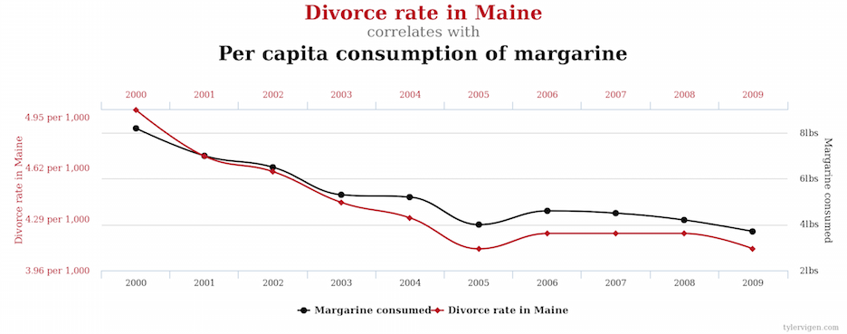

## Correlation does not imply causation

http://tylervigen.com/spurious-correlations

## Confounding

If we want to study the relationship between X and Y, we say that C is a confounder of the relationship between X and Y if C causes both X and Y.

## Thinking about causality

Does smoking cause lung cancer?

We would like to have a person who doesn't smoke and observe if he develops lung cancer and ideally compare to the same man in a parallel universe where he does smoke. Such a pair of outcomes is called a set of **potential outcomes**.

## Potential outcomes

$Y_i(0)$ is the potential outcome for study unit $i$ under the control condition
$Y_i(1)$ is the potential outcome for study unit $i$ under the treatment condition