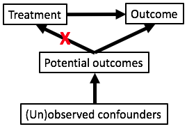

```{r global_options, include=FALSE}
knitr::opts_chunk$set(echo=FALSE, warning=FALSE, message=FALSE)
```

## Slide credits

Much of the material draws upon or is adapted from [Elizabeth Stuart's](http://www.biostat.jhsph.edu/~estuart/index.html) slides from her [causal inference class](https://courseplus.jhu.edu/core/index.cfm/go/syl:syl.public.view/catalogID/23321)

# What are causal effects?

## Correlation does not imply causation


[More fun with spurious correlations](http://tylervigen.com/spurious-correlations)

## Confounding

If we want to study the relationship between X and Y, we say that C is a confounder of the relationship between X and Y if C causes both X and Y resulting in little to no direct influence of X on Y.

## Thinking about causality

- Does smoking cause lung cancer?
- Alternatively, what is the effect of smoking on the risk of developing lung cancer? We have some cause, smoking, and want to know its effect on an outcome, the risk of developing lung cancer.
- One approach: obtain lung cancer rates in a set of people who smoke and in a set of people who do not smoke. What is wrong with this approach?

## Bradford-Hill criteria

1. Strength (effect size)
2. Consistency (reproducibility)
3. Specificity
4. Temporality
5. Biological gradient
6. Plausibility
7. Coherence
8. Experiment
9. Analogy

[Wikipedia](https://en.wikipedia.org/wiki/Bradford_Hill_criteria) and [original article](https://www.edwardtufte.com/tufte/hill)

[Zika Virus and Birth Defects - Reviewing the Evidence for Causality](http://www.nejm.org/doi/full/10.1056/NEJMsr1604338)

## Causal inference: goals of the field

- The field of causal inference is dedicated to developing and using methods to study causal effects.
- In particular, causal effects are the effect of a cause as opposed to the the cause of an effect
    - Cause of an effect: what causes lung cancer?
    - Effect of a cause: what is the effect of smoking on developing lung cancer?

## Ideal situation: observing parallel universes

- We would like to have a person who doesn't smoke and observe if he develops lung cancer and ideally compare to the same man in a parallel universe where he does smoke.
- Such a pair of outcomes is called a set of **potential outcomes**. The outcome in the parallel universe is called a **counterfactual outcome**.
- A framework for thinking about potential outcomes is detailed in the **Rubin causal model**.

## Rubin causal model

A framework for precise formulation of causal effects

- Treatment
- Units
- Potential outcomes

## Treatment

- Must be able to be administered as an **intervention**
- Non-examples:
    - BMI: "having a high BMI"
    - Sex: "being female"
    - Preferences: "liking Pepsi"
- Examples:
    - Weight loss program
    - Gender partial policies
    - Advertising campaigns for Pepsi

## Units

- Entities to which we can administer treatment or withhold treatment
- Units are also defined to be different at different times
    - For example, me right now is a different unit than me one hour from now

## Potential outcomes

Outcomes that could be observed for each unit under the different levels of the treatment (typically two levels):

$Y_i(0)$ is the **potential outcome** for study unit $i$ under the control condition.
$Y_i(1)$ is the **potential outcome** for study unit $i$ under the treatment condition.

If a study unit receives a particular level of the treatment (e.g. control) in real life, then the outcome under the other level of the treatment (e.g. treatment) is called the **counterfactual** outcome.

## Fundamental problem of causal inference

Example: viral load levels 5 days post-physician visit

 Units   $Y_i(1)$   $Y_i(0)$   $T_i$
------- ---------- ---------- -------
  1       30            ?        1
  2       ?            15        0
  .       .             .        .
  .       .             .        .
  N       22            ?        1

$T_i$ is the indicator of the treatment actually received.

## Causal effects (ideal)

What if we could observe study unit $i$ in both parallel universes? How might we compute the causal effect of treatment for this study unit?

$$ Y_i(1) - Y_i(0) $$

But we can't observe both of these!

## Typical causal effects estimated

Average treatment effect (ATE): average effect for everyone in the population

$$ ATE = \frac{1}{N}\sum_{i=1}^N (Y_i(1) - Y_i(0)) $$

Average treatment effect for the treated (ATT): average effect for only those treated

$$ ATT = \frac{1}{N}\sum_{i \in T} (Y_i(1) - Y_i(0)) $$

where $T$ is the set of people who received the treatment ($T_i = 1$)

## Examples: ATE and ATT

- Effect of heavy adolescent drug use on earnings at age 30
    - ATE: average effect of drug use on everyone, if everyone were forced to take drugs
    - ATT: average effect of drug use only on those who take drugs
- Effect of personalized tutoring on high school GPA
    - ATE: average effect of tutoring for everyone, if everyone were forced to get tutoring
    - ATT: average effect of tutoring only for those who obtain tutors
- ATE generally applies to beneficial interventions
- ATT generally applies to harmful interventions

# How do we learn about causal effects?

## Key concepts

- Replication
- Stable Unit Treatment Value Assumption (SUTVA)
- Assignment mechanism

## Replication

- Collect data on multiple units where there is a mix of units receiving and not-receiving the treatment

## SUTVA

- If outcomes for one person could depend on someone else's treatment assignment, then the number of potential outcomes would explode
    - e.g. Person 1's potential outcomes would not only be for treatment and control but also for both given every possible combination of other individual's treatment assigments
- The Stable Unit Treatment Value Assumption (SUTVA) deals with this complication. It assumes:
    1. No interference between units: treatment assignment of one unit does not affect potential outcomes of another unit
        - Drug use of one person doesn't affect someone else's outcomes
    2. Treatment only has one version
        - "Heavy" drug use doesn't have distinct subcategories such as "very heavy" or "moderately heavy"

## Assignment mechanism

- Process that determines which treatment each unit receives
- Randomized experiments
    - Known, clean assignment mechanism
- Observational studies
    - Have to guess an assignment mechanism
    - Have to propose an explanation for why certain individuals become heavy drug users
- Study designs in causal inference try to capitalize on some feature of the world that allows for knowledge about the assignment mechanisms

## Exercise: comparing two groups

"A large university is interested in investigating the effects on the students of the diet provided in the university dining halls and any sex differences in these effects. Various types of data are gathered. In particular, the weight of each student at the time of his arrival in September and his weight the following June are recorded." (Frederic Lord 1967, p. 304)

## Two statisticians

Statistician 1: No evidence of differential effect of diet between sexes

- Does not adjust observed weight changes (outcome) for initial weight
- Looks at the difference in mean weight changes between men and women
- Neither men nor women show a change in weight from September to June

Statistician 2: Diet has larger effect on men

- Adjusts observed weight changes for initial weight
- Uses regression to model June weight as a function of sex and September weight
- Holding September weight constant, men will weigh more in June on average

## Thought exercise

What is the treatment? What is the causal effect?

Which statistician's analysis is correct for determining the causal effect?

## Resolution

This study has no control! We are interested in the effect of university diet on weight - this is the treatment. Everyone in the study received the treatment!

The two statisticians aren't actually able to answer the main questions:

- What is the causal effect of university diet on weight changes?
- Is this effect different in men and women?

This example is known as [Lord's paradox](https://en.wikipedia.org/wiki/Lord's_paradox).

## Lord's paradox: data in RCM form

---------------------------------------------------------
 Units   Sex, Sept. weight   $Y_i(0)$   $Y_i(1)$   $T_i$
------- ------------------- ---------- ---------- -------
  1             M,140            ?        141        1

  2             F,120            ?        119        1

  .               .              .         .         .

  N             M,150            ?        144        1
---------------------------------------------------------

## Control assumption: statistician 1

$$ E[\mathrm{weight\:change}] = \beta_0 + \beta_1\mathrm{sex} $$
$$ E[\mathrm{June\:weight\:under\:control}] = \beta_0 + \beta_1\mathrm{sex} + \mathrm{Weight}_\mathrm{Sept} $$

---------------------------------------------------------
 Units   Sex, Sept. weight   $Y_i(0)$   $Y_i(1)$   $T_i$
------- ------------------- ---------- ---------- -------
  1             M,140          140        141        1

  2             F,120          120        119        1

  .               .              .         .         .

  N             M,150          150        144        1
---------------------------------------------------------

Fail to reject $H_0: \beta_0 = 0$ and $H_0: \beta_1 = 0$

## Control assumption: statistician 2

$$ E[\mathrm{weight\:change}] = \beta_0 + \beta_1\mathrm{sex} + \beta_3\mathrm{Weight}_\mathrm{Sept} $$
$$ E[\mathrm{June\:weight\:under\:control}] = \beta_0 + \beta_1\mathrm{sex} + \beta_3\mathrm{Weight}_\mathrm{Sept} + \mathrm{Weight}_\mathrm{Sept} $$

---------------------------------------------------------------------------------
 Units   Sex, Sept. weight   $Y_i(0)$                           $Y_i(1)$   $T_i$
------- ------------------- ---------------------------------- ---------- -------
  1             M,140        $\beta_0+\beta_1+140(\beta_3+1)$     141        1

  2             F,120        $\beta_0+120(\beta_3+1)$             119        1

  .               .              .                                 .         .

  N             M,150        $\beta_0+\beta_1+150(\beta_3+1)$     144        1
---------------------------------------------------------------------------------

# Estimating causal effects: randomized trials

## Worrying about confounding

- Why is confounding a worry when trying to ascertain causal effects?
- Consider a situation where we want to know how effective a drug is at reducing viral load but people with less severe illness are more likely to obtain the drug than those with more severe illness.
- How is our estimate of drug efficacy affected?

<div style="text-align: center">

</div>

## Randomized controlled trials

In RCTs, study units are randomly assigned to the treatment or control condition. What does this imply about the links in the causal diagram?

<div style="text-align: center">

</div>

$$ P(T \mid X, Y(0), Y(1)) = P(T \mid X) $$

This property is known as **unconfounded treatment assignment**. For this reason, RCTs are said to be the gold standard for assessing causal effects. However, RCTs are not so clean in real life (see later slides) and sometimes aren't ethical.

## Analyzing RCTs

- Regression analysis: $E[\mathrm{outcome}] = \beta_0 + \beta_T\mathrm{treatment} + \beta_1 x_1 + \cdots + \beta_p x_p$
    - With randomized trials, we **expect** no difference in $x_1, \ldots, x_p$ between the treatment arms.
    - But there will still be some variation between the arms, and these predictors likely do help explain the outcome, so including them in the regression model is useful because we get a more refined estimate of the treatment effect.

- Tests for comparing two groups
    - t-tests, Wilcoxon rank sum tests
    - Tests for comparing proportions

## Points to consider when evaluating RCTs

- Data quality
    - Ascertainment biases, measurement error, missing data
- Small sample sizes
    - A RCT on 20 subjects is likely not better than a larger well-designed observational study.
- Interference between units
    - This would violate the SUTVA assumption.
    - e.g. Could people on treatment share information with those on control?
- Generalizability
- How well did the randomization work?
    - Were the different arms actually balanced for all important confounders?
- Noncompliance
    - Do subjects actually stick to their treatment arm?

## Generalizability: RCT design spectrum

- Efficacy trials
- Effectiveness trials
- Pragmatic trials

## Efficacy trials

- Also called "explanatory trials"
- Tries to answer: what is the effect of treatment under optimal conditions?
- Proof of concept
- Often has more stringent inclusion and exclusion criteria

## Effectiveness trials

- Treatment is delivered as it would be "in the real world"
- Gives a more realistic picture of how the treatment would work in practice

## Pragmatic trials

- Very large-scale trials
- Enroll diverse populations and deliver "real world" versions of the treatment
- Similar to effectiveness trials but generally describes larger studies
- Pros: if treatment shows a positive effect, good evidence it will work in practice
- Cons: if null results, unclear if that is the truth or if this was due to the trial not being run well enough
- PRECIS criteria can help investigators gauge how "explanatory" or "pragmatic" their trial is

## Noncompliance

- "It Is Essential to Study Program Implementation" and "Use What Has Been Learned About Preventing and Analyzing Attrition" (Shadish)
- "Classically, the problem has been whether to analyze data according to how participants were assigned (an intent-to-treat analysis), which preserves the integrity of random assignment but describes the effect of assignment to treatment rather than of treatment itself, or to analyze data according to treatment received, which confounds treatment receipt with selection bias into treatment so that the causal estimate may be biased."
- Compliance and dropout characteristics likely confound the relationship between treatment and outcome.
- We will look more at noncompliance when we discuss instrumental variables.

## Randomization designs

- Bernoulli (coin flip)
    - Useful if subjects are coming in one at a time
- Complete randomization (pulling names out of a hat)
    - Useful if want to ensure certain number of treated subjects
- Block randomization
    - Eliminates chance imbalances in blocking variables (e.g., gender)
- Cluster/group randomization
    - Relevant especially if treatment at group level. e.g. Classrooms randomized to teaching strategies rather than students randomized to learning strategies
    - Can help make SUTVA more reasonable
- Sequential randomization/adaptive designs
    - Want to learn as the study progresses. e.g. In drug trials, may learn quickly that one group benefits more

## How well did the randomization work? Practical considerations

- "The Logistics of Selection and Assignment Can Make or Break Your Experiment" (Shadish)
- Hypothetical situation: create random assignments beforehand (1: treament, 0: control): 1001010011
    - First patient comes in: should be treated (don't tell patient in a blinded experiment)
    - A lot of information must be conveyed regarding the study
    - At the end of the process, the patient declines to participate
    - What if this happens over and over? What problems could arise?

# Estimating causal effects: interrupted time series and regression discontinuity designs

## Interrupted time series

- How does the time trend of an outcome change after a policy is introduced?
    - Treatment: policy
    - Units: people in the population
    - Potential outcomes: health outcomes under the policy and health outcomes without the policy
    - Estimates ATE or ATT depending on the population subject to the policy

## Interrupted time series

- How does the time trend of a control outcome change after the policy is introduced?
    - Called comparative interrupted time series
    - Gets at the specificity of the intervention effect
    - If the intervention affects many different outcomes, this is weaker evidence than if it only affects the outcome of interest
    - Allows estimates of ATE and ATT
- Nice feature: knowing how policy was introduced means we know the assignment mechanism

## Interrupted time series

Treated units: states subject to health insurance policy

```{r fig.width=10}
par(mar = c(5,4,0.2,2))
## Plot time trend of interest before and after intervention
x <- c(1:15,15.01,16:30)
y1_treated_counter <- 0.3*x
y1 <- 0.3*x
y1[x > 15] <- 0.5*x[x > 15] + 1
plot(x[x <= 15], y1[x <= 15], type = "l", xlim = range(x), ylim = range(y1), xlab = "Time", ylab = "Outcome")
lines(x[x > 15], y1[x > 15])
lines(x[x > 15], y1_treated_counter[x > 15], lty = "dashed", col = "gray50")
abline(v = 15, lwd = 4)
text(x = 13, y = 1, labels = "Intervention")
legend("bottomright", legend = c("Treated units (observed)", "Treated units (counterfactual)"), col = c("black", "gray50"), lty = "solid", bty = "n")
```

## Interrupted time series

Treated units: states subject to health insurance policy

Control units: states not subject to health insurance policy

```{r fig.width=10}
par(mar = c(5,4,0.2,2))
## Add time trend for control group before and after intervention
## This trend has a jump at intervention time
y2_ctrl_counter <- 0.2*x + 8
y2 <- 0.2*x + 8
y2[x > 15] <- 0.3*x[x > 15] + 0.5 + 8
plot(x[x <= 15], y1[x <= 15], type = "l", xlim = range(x), ylim = range(y1, y2), xlab = "Time", ylab = "Outcome")
lines(x[x > 15], y1[x > 15])
lines(x[x > 15], y1_treated_counter[x > 15], lty = "dashed", col = "gray50")
## Control group
lines(x[x <= 15], y2[x <= 15], col = "red")
lines(x[x > 15], y2[x > 15], col = "red")
lines(x[x > 15], y2_ctrl_counter[x > 15], lty = "dashed", col = "deeppink")
abline(v = 15, lwd = 4)
text(x = 13, y = 1, labels = "Intervention")
legend("bottomright", legend = c("Treated units (observed)", "Control units (observed)", "Treated units (counterfactual)", "Control units (counterfactual)"), col = c("black", "red", "gray50", "deeppink"), lty = "solid", bty = "n")
```

## Interrupted time series

Treated units: states subject to health insurance policy

Control units: states not subject to health insurance policy

```{r fig.width=10}
par(mar = c(5,4,0.2,2))
## Add time trend for control group before and after intervention
## This trend has a much smaller jump at intervention time
y2_ctrl_counter <- 0.2*x + 8
y2 <- 0.2*x + 8
y2[x > 15] <- 0.2*x[x > 15] + 0.05 + 8
plot(x[x <= 15], y1[x <= 15], type = "l", xlim = range(x), ylim = range(y1, y2), xlab = "Time", ylab = "Outcome")
lines(x[x > 15], y1[x > 15])
lines(x[x > 15], y1_treated_counter[x > 15], lty = "dashed", col = "gray50")
## Control group
lines(x[x <= 15], y2[x <= 15], col = "red")
lines(x[x > 15], y2[x > 15], col = "red")
lines(x[x > 15], y2_ctrl_counter[x > 15], lty = "dashed", col = "deeppink")
abline(v = 15, lwd = 4)
text(x = 13, y = 1, labels = "Intervention")
legend("bottomright", legend = c("Treated units (observed)", "Control units (observed)", "Treated units (counterfactual)", "Control units (counterfactual)"), col = c("black", "red", "gray50", "deeppink"), lty = "solid", bty = "n")
```

## Interrupted time series: caveats

- How do we model the time trends before and after the intervention?
    - Time series methods, regression
    - As with regression we assume that this time trend model is correctly specified
- History: confounding due to other events that co-occur with the intervention
- Instrumentation: if the measurement instrument or process changes over time
- Instability: variability in the time series

## Interrupted time series: caveats

- Regression to the mean: tendency of extreme scores to regress toward the mean on later measurement occasions
    - If units tend to have extreme measures on their first measurement, later repeat measurements will tend to settle closer to the actual mean
    - Helps if units have many repeated measures
- Selection: if treatment and comparison communities different in ways that are confounded with the intervention
- Lack of control of the implementation of the program: hard to separate out effects of the process of implementing the program from effects of the program itself
    - Ideal would be to randomly choose the time of program implementation

## Regression discontinuity

- Take advantage of some arbitrary cutoff that determines who gets treatment or not
    - Treatment: the treatment itself (e.g. drug targeted to select populations)
    - Units: patients
    - Potential outcomes: college success with and without the 
- Main argument: people just above and just below the cutoff essentially similar, except for their receipt of the intervention
    - Assumes smooth model underlying the outcome in absence of the intervention

## Regression discontinuity

Example: What is the effect on college success of an advanced education program? Program is given to students who exceed a cutoff.

```{r fig.width=10}
set.seed(1)
n <- 500
score <- runif(n, 80, 150)
success_null <- 0.5*score + rnorm(n, mean = 0, sd = 5)
success_pos <- 0.5*score + rnorm(n, mean = 0, sd = 5)
success_pos[score > 120] <- 0.5*score[score > 120] + 15 + rnorm(sum(score > 120), mean = 0, sd = 5)
par(mfrow = c(1,2))
plot(score, success_null, xlab = "Score", ylab = "College success", main = "No effect")
abline(v = 120, lwd = 3)
plot(score, success_pos, xlab = "Score", ylab = "College success", main = "Positive effect")
abline(v = 120, lwd = 3)
```

## Regression discontinuity: caveats

- Treatment effect estimated: not ATE or ATT but rather effect for people who barely could have received either treatment or no treatment
- Need to check that those just above and below are comparable for confounding characteristics
- How do we model the trend above and below the cutoff?
- We assume that the cutoff is followed exactly
- All participants in the intervention receive the same level and amount of intervention (SUTVA)
