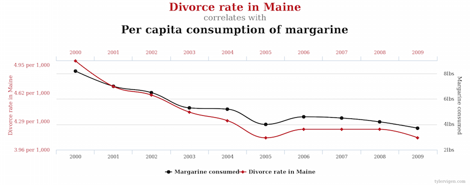

```{r global_options, include=FALSE}
knitr::opts_chunk$set(echo=FALSE, warning=FALSE, message=FALSE)
```

## JHSPH class on causal inference

[Elizabeth Stuart](http://www.biostat.jhsph.edu/~estuart/index.html) teaches a [class on causal inference](https://courseplus.jhu.edu/core/index.cfm/go/syl:syl.public.view/catalogID/23321) that is offered in-person third term and online fourth term

----

<h2 class="divider">What are causal effects?</h2>

## Correlation does not imply causation

<div align="center">

</div>

Alt text: Correlation doesn't imply causation, but it does waggle its eyebrows suggestively and gesture furtively while mouthing 'look over there'.

## Correlation does not imply causation

<div align="center">

</div>

[More fun with spurious correlations](http://tylervigen.com/spurious-correlations)

## Thinking about causality

- Does smoking cause lung cancer?
- One approach: follow smokers and non-smokers over time to obtain lung cancer rates. Thoughts on this approach?

## Confounding

If we want to study the relationship between X and Y, we say that C is a confounder of the relationship between X and Y if C causes both X and Y resulting in little to no direct influence of X on Y.

## Bradford-Hill criteria

1. Strength (effect size)
2. Consistency (reproducibility)
3. Specificity
4. Temporality
5. Biological gradient
6. Plausibility
7. Coherence
8. Experiment
9. Analogy

[Wikipedia](https://en.wikipedia.org/wiki/Bradford_Hill_criteria) and [original article](https://www.edwardtufte.com/tufte/hill)

[Zika Virus and Birth Defects - Reviewing the Evidence for Causality](http://www.nejm.org/doi/full/10.1056/NEJMsr1604338)

## Goals of the field

- The field of causal inference is dedicated to developing and using methods to study causal effects.
- In particular, we look at causal effects as the effect of a cause as opposed to the the cause of an effect.
    - Cause of an effect: what causes lung cancer?
    - Effect of a cause: what is the effect of smoking on developing lung cancer?

## Exercise: comparing two statisticians

University officials are interested in determining if the food served at the main cafeteria is causing weight gain in the freshman class. Specifically they want to know whether this weight gain is different in men and women. They have data on the September and May weights of all members of last year's freshman class. Two statisticians are called in to conduct an analysis.

## Exercise: comparing two statisticians

Statistician 1: No evidence of differential effect of diet between sexes

- Computes the weight change from September to May for each freshman and separates these differences by sex
- Compares these weight changes in males and females using a t-test
- Does not find a statistically significant difference between men and women and concludes that there is no evidence that the cafeteria is causing differential weight gain in male and female freshmen

Statistician 2: Diet has larger effect on men

- Models weight change as a function of September weight and gender using linear regression
- Uses regression to model weight change as a function of sex and September weight
- Holding September weight constant, men will gain more weight by June on average

## Discussion

Which statistician is right? Both? Neither? Why?

## Ideal situation: observing parallel universes

- We would like to have a person who doesn't smoke and observe if he develops lung cancer and ideally compare to the same man in a parallel universe where he does smoke.
- Such a pair of outcomes is called a set of **potential outcomes**. The outcome in the parallel universe is called a **counterfactual outcome**.
- A framework for thinking about potential outcomes is detailed in the **Rubin causal model**.

## Rubin causal model

A framework for precise formulation of causal effects that consists of:

- Treatment
- Units
- Potential outcomes

## Treatment

- Must be able to be administered as an **intervention**
- Non-examples:
    - BMI: "having a high BMI"
    - Sex: "being female"
    - Preferences: "liking Pepsi"
- Examples:
    - Weight loss program
    - Gender partial policies
    - Advertising campaigns for Pepsi
- How might we study patient attitudes towards their healthcare provider?

## Units

- Entities to which we can administer treatment or withhold treatment
- Units are also defined to be different at different times
    - For example, me right now is a different unit than me one hour from now.

## Potential outcomes

Outcomes that could be observed for each unit under the different levels of the treatment (typically two levels):

$Y_i(0)$ is the **potential outcome** for study unit $i$ under the control condition.
$Y_i(1)$ is the **potential outcome** for study unit $i$ under the treatment condition.

If a study unit receives a particular level of the treatment (e.g. control) in real life, then the outcome under the other level of the treatment (e.g. treatment) is called the **counterfactual** outcome.

## Fundamental problem of causal inference

Example: Effect of medication on blood pressure

 Units   $Y_i(1)$   $Y_i(0)$   $T_i$
------- ---------- ---------- -------
  1       110           ?        1
  2       ?            125       0
  .       .             .        .
  .       .             .        .
  N       105           ?        1

$T_i$ is the indicator of the treatment actually received (1 = medication, 0 = placebo)

Exercise: draw what this table would look like for the cafeteria study (Lord's paradox).

## Causal effects (ideal)

What if we could observe study unit $i$ in both parallel universes? How might we compute the causal effect of treatment for this study unit?

$$ Y_i(1) - Y_i(0) $$

This is called the **individual level causal effect**. But we can't observe both of these potential outcomes!

Causal inference methods try to estimate average causal effects over a population.

## Typical causal effects estimated

Average treatment effect (ATE): average effect for everyone in the population

$$ ATE = \frac{1}{N}\sum_{i=1}^N (Y_i(1) - Y_i(0)) $$

Average treatment effect for the treated (ATT): average effect for only those treated

$$ ATT = \frac{1}{N}\sum_{i \in T} (Y_i(1) - Y_i(0)) $$

where $T$ is the set of people who received the treatment ($T_i = 1$)

## Examples: ATE and ATT

- Effect of heavy adolescent drug use on earnings at age 30
    - ATE: average effect of drug use on everyone, if everyone were forced to take drugs
    - ATT: average effect of drug use only on those who take drugs
- Effect of personalized tutoring on high school GPA
    - ATE: average effect of tutoring for everyone, if everyone were forced to get tutoring
    - ATT: average effect of tutoring only for those who obtain tutors
- ATE generally applies to beneficial interventions
- ATT generally applies to harmful interventions

----

<h2 class="divider">How do we learn about causal effects?</h2>

## Key concepts

- Replication
- Stable Unit Treatment Value Assumption (SUTVA)
- Assignment mechanism

## Replication

- Collect data on multiple units where there is a mix of units receiving and not-receiving the treatment

## SUTVA

Stable Unit Treatment Value Assumption

1. No interference between units: treatment assignment of one unit does not affect potential outcomes of another unit

    - Drug use of one person doesn't affect someone else's outcomes.
    - If it did, the number of potential outcomes would explode. Unit 1's potential outcomes would not only be for treatment and control but also for both given every possible combination of other individual's treatment assigments.

2. Treatment only has one version

    - "Heavy" drug use doesn't have distinct subcategories such as "very heavy" or "moderately heavy"

## Assignment mechanism

- Process that determines which treatment each unit receives
- Randomized experiments
    - Known, clean assignment mechanism
- Observational studies
    - Have to guess an assignment mechanism
    - e.g. Propose an explanation for why certain individuals become heavy drug users
- Study designs in causal inference try to capitalize on some feature of the world that allows for knowledge about the assignment mechanisms.
- Key idea: not all assignment mechanisms are of the same quality or equally useful.

## Assignment mechanisms: confoundedness and ignorability

- An assignment mechanism is **ignorable** if treatment/control assignment is independent of unobserved potential outcomes.
- An assignment mechanism is **unconfounded** if treatment/control assignment is independent of all potential outcomes (both observed and unobserved).
- Which of the following are possible?
    - unconfounded, ignorable
    - unconfounded, nonignorable
    - confounded, ignorable
    - confounded, nonignorable

## Confounded but ignorable

- Assignment depends on observed potential outcomes (dependence on any potential outcomes indicates confoundedness)
- Often occurs in sequential randomization studies: randomize based on the observed outcome of the previous patient.
    - e.g. Favoring selection of the control outcome if treatment outcome is poor or if control outcome is good.
- Idea: if each unit's probability of assignment depends only on things we observe, we can still make inferences about the treatment effect and its uncertainty. We just need to upweight or downweight units in an appropriate way. (Next week: propensity scores)

## Selection bias

Think about how you have typically described selection bias/confounding factors. How can we translate that to this table?

 Units   $Y_i(0)$   $Y_i(1)$   Effect
------- ---------- ---------- --------
  1       10           9         -1
  2       11           12        1
  3       12           11        -1
  4       13           12        -1
  5       14           15        1
  6       15           16        1
  Mean    12.5         12.5      0

[Perfect Doctor example](https://en.wikipedia.org/wiki/Rubin_causal_model#The_perfect_doctor)

----

<h2 class="divider">Introduction to matching</h2>

## Idea

- We want to compare apples to apples so we only want individuals who are identical except for their treatment assignment.
- Individuals that we can't match are too different to include in the analysis.
    - We don't have a good idea of the counterfactual for these individuals.

## Matching methods

- Exact matching
- Coarsened exact matching
- Distance-based matching
- Propensity scores (more on this next week)

## Exact matching

- For each treated individual, find a control who matches on all other covariates.

## Coarsened exact matching

- "Coarsen" covariates before matching
- e.g. Instead of exact matching on age, perform exact matching on age categories.

## Distance-based matching

- Compute a distance between the covariate values of all individuals and match each individual to the individuals with the smallest distance
- Common distance metric is the **Mahalanobis distance**:

$$ d(x,y) = \sqrt{(x-y)^T S^{-1} (x-y)} $$

- $S$ is a covariance matrix so this metric measures the distance between two sets of covariate values $x$ and $y$ in variability units

## Pros and cons of matching methods

What are some advantages and disadvantages of these matching methods?

## Matching and assignment mechanisms

How are the ideas of matching and assignment mechanisms related?
