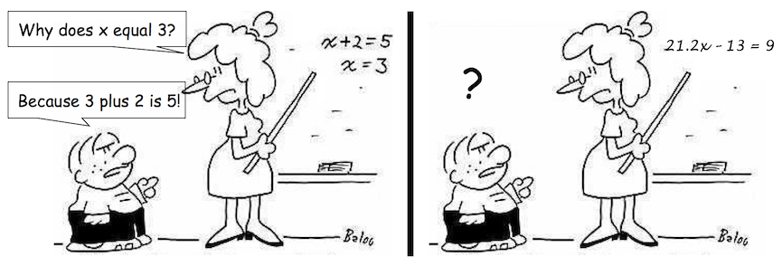
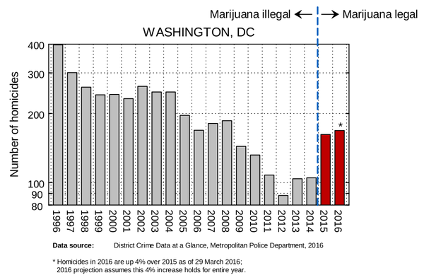
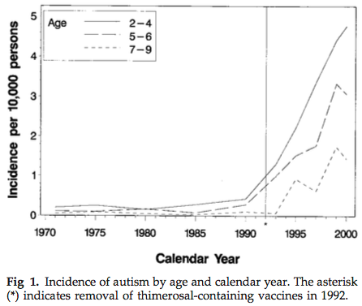

```{r global_options, include=FALSE}
knitr::opts_chunk$set(echo=FALSE, warning=FALSE, message=FALSE)
```

----

<h2 class="divider">Recap</h2>

## Why use the Rubin causal model?

<div align="center">

</div>

## Rubin causal model

Scientific goal: Use an observational study to learn about the causal effect of a free medical clinic on health outcomes for the homeless.

- Treatment
- Units
- Potential outcomes
- Assignment mechanism
- SUTVA

## Assignment mechanisms: confoundedness and ignorability

- An assignment mechanism is **ignorable** if treatment/control assignment is independent of unobserved potential outcomes.
- An assignment mechanism is **unconfounded** if treatment/control assignment is independent of all potential outcomes (both observed and unobserved).
- Which of the following are possible?
    - unconfounded, ignorable: ideal situation typically only possible in randomized trials
    - unconfounded, nonignorable: not possible
    - confounded, ignorable: typical of sequential randomized trials
    - confounded, nonignorable: typical of observational studies

## Confounded treatment assignment, nonignorable

Selection bias: "Unhealthier people tend to be in the control group." If low numbers indicate worse health outcomes, what units would tend to be in the control group? What columns are you looking at to decide?

 Units   $Y_i(0)$   $Y_i(1)$   Effect
------- ---------- ---------- --------
  1       10           9         -1
  2       11           12        1
  3       12           11        -1
  4       23           22        -1
  5       24           25        1
  6       25           26        1
  Mean    12.5         12.5      0

## Confounded treatment assignment, nonignorable

 Units   $Y_i(0)$   $Y_i(1)$   Effect
------- ---------- ---------- ---------
  1       10                     -1
  2       11                     1
  3       12                     -1
  4                    22        -1
  5                    25        1
  6                    26        1
  Mean    11          24.3       13.3

Something related to the units' potential outcomes influenced their treatment group.

## Difference between treatment groups, but unconfounded!

- Units who wear blue shirts tend to be in the control group.
- We're ok here!

----

<h2 class="divider">Matching methods</h2>

## Relationship between matching and assignment mechanism

- We want to compare apples to apples so we only want individuals who are identical except for their treatment assignment.
- Matching is a way to combat confounded assignment mechanisms. Why? Try to picture how the RCM table is being filled out.

## Matching methods

- Exact matching
- Coarsened exact matching
- Distance-based matching
- Propensity scores

## Exact matching

- For each treated individual, find a control who matches on all other covariates.

## Coarsened exact matching

- "Coarsen" covariates before matching
- e.g. Instead of exact matching on age, perform exact matching on age categories.

## Distance-based matching

- Compute a distance between the covariate values of all individuals and match each individual to the individuals with the smallest distance

## Exercise: what method would you choose?

Covariates: age, sex, race, distance to nearest hospital, takes medication 1, takes medication 2, takes medication 3, takes medication 4, takes medication 5, average daily caloric intake

What matching method would you choose and why?

----

<h2 class="divider">Propensity score methods</h2>

## Idea

- Want to look at treated and control groups that have similar covariate values
- Instead of matching on each covariate (potentially many), use a summary measure of the covariate values

## Propensity scores

- **Definition**: probability of receiving the treatment given the observed covariates

$$ \mathrm{Propensity\:score} = e_i = P(T_i = 1 | X_i) $$

- Two key properties:
    1. Treated and control units with the same/similar propensity scores should be similar in their covariates (balancing score property).
    2. If selection into treatment and control groups depends only on observed covariates, I can match on the propensity score rather than on all of the observed covariates (unconfoundedness property).

## Activity: propensity score matching

```
install.packages("MatchIt")
library(shiny)
runGitHub("shiny_education_apps", "lmyint", subdir = "propensity_scores")
```

- What impacts how many units are matched?
- Can you verify property 1?
- What do you notice about frequency of unmatched units with low/high propensity scores?
- What happens when you change the control:treat ratio and the caliper sliders?

## Numerical summaries of balance

- Most common: standardized bias or standardized difference
    - Difference in means of the covariate in the treatment and control groups divided by a standard deviation (SD).
    - The SD can be over all treated and controls or just one of the groups. Key idea is to use the same number before and after matching for a fair comparison.

$$ B = \frac{\bar X_t - \bar X_c}{\sqrt{\sigma_x^2}} $$

## Common support/overlap condition

- Idea: everyone needs to have a positive probability of receiving either treatment.
- Exclude controls who would never be treated and treated who would never be controls.
    - For these individuals, we would never know their counterfactual outcome.

<div style="text-align: center">

</div>

Schneeweiss S. Developments in post-marketing comparative effectiveness research. Clin Pharmacol Ther 2007 Aug;82(2):143-56.

## Property 1: propensity scores as balancing scores

- At each value of the propensity score, the distribution of observed covariates (that went into the propensity score) is the same in the treated and control groups.
- Intuitively, if two people had the same probability of receiving the treatment (e.g., becoming heavy drug users) and one did and one didn't, it must have been random as to who did and who didn't.
- Within small range of propensity score values, treated and comparison individuals should look only randomly different on the observed covariates.
- In practice, need to check the similarity of covariate values in propensity score bins or between the treatment and control groups.

## Property 2: unconfoundedness

- If unconfoundedness holds given the full set of observed covariates, it also holds given the propensity score. In other words:

$P(T \mid X, Y(0), Y(1)) = P(T \mid X)$ (unconfounded treatment assignment) implies

$P(T \mid X, Y(0), Y(1)) = P(T \mid e(X))$ (unconfoundedness given the propensity score $e(X)$)

- This property allows us to match on the propensity score alone - don't need to match on all covariates individually.

## Estimating propensity scores

- Any method for modeling the probability of a categorical event (treatment is usually binary).
- Logistic regression is most commonly used.

## Using propensity scores

- $k$-nearest neighbor matching
    - Keep matched units and discard others.
    - ATT estimation: For each treated subject, find the $k$ controls with the closest propensity score.
- Use propensity scores as weights
    - ATE estimation: weight all subjects to look the combined population (to look like an "average person")
    - ATT estimation: weight controls to look like treated subjects

Any of the above approaches are nearly always used with regression - we gain the benefit of regression adjustment and comparable groups.

## What treatment effect is being estimated?

Need to think carefully about what units are being matched to (fixed set) and what set of units we are searching in to find those matches

----

<h2 class="divider">Interrupted time series and regression discontinuity designs</h2>

## Interrupted time series

- How does the time trend of an outcome change after a policy is introduced?
- How does the time trend of a control outcome change after the policy is introduced?
    - Gets at the specificity of the intervention effect.
    - If the intervention affects many different outcomes, this is weaker evidence than if it only affects the outcome of interest.
- Both questions can be assessed in primary and control populations.
- We are looking for some change in behavior at the time of intervention.
- Knowing how the policy was introduced means we know the assignment mechanism - is it unconfounded, ignorable?

## Interrupted time series

Treated units: states subject to health insurance policy

```{r fig.width=10}
par(mar = c(5,4,0.2,2))
## Plot time trend of interest before and after intervention
x <- c(1:15,15.01,16:30)
y1_treated_counter <- 0.3*x
y1 <- 0.3*x
y1[x > 15] <- 0.5*x[x > 15] + 1
plot(x[x <= 15], y1[x <= 15], type = "l", xlim = range(x), ylim = range(y1), xlab = "Time", ylab = "Outcome")
lines(x[x > 15], y1[x > 15])
lines(x[x > 15], y1_treated_counter[x > 15], lty = "dashed", col = "gray50")
abline(v = 15, lwd = 4)
text(x = 13, y = 1, labels = "Intervention")
legend("bottomright", legend = c("Treated units (observed)", "Treated units (counterfactual)"), col = c("black", "gray50"), lty = "solid", bty = "n")
```

## Interrupted time series

Treated units: states subject to health insurance policy

Control units: states not subject to health insurance policy

```{r fig.width=10}
par(mar = c(5,4,0.2,2))
## Add time trend for control group before and after intervention
## This trend has a jump at intervention time
y2_ctrl_counter <- 0.2*x + 8
y2 <- 0.2*x + 8
y2[x > 15] <- 0.3*x[x > 15] + 0.5 + 8
plot(x[x <= 15], y1[x <= 15], type = "l", xlim = range(x), ylim = range(y1, y2), xlab = "Time", ylab = "Outcome")
lines(x[x > 15], y1[x > 15])
lines(x[x > 15], y1_treated_counter[x > 15], lty = "dashed", col = "gray50")
## Control group
lines(x[x <= 15], y2[x <= 15], col = "red")
lines(x[x > 15], y2[x > 15], col = "red")
lines(x[x > 15], y2_ctrl_counter[x > 15], lty = "dashed", col = "deeppink")
abline(v = 15, lwd = 4)
text(x = 13, y = 1, labels = "Intervention")
legend("bottomright", legend = c("Treated units (observed)", "Control units (observed)", "Treated units (counterfactual)", "Control units (counterfactual)"), col = c("black", "red", "gray50", "deeppink"), lty = "solid", bty = "n")
```

## Interrupted time series

Treated units: states subject to health insurance policy

Control units: states not subject to health insurance policy

```{r fig.width=10}
par(mar = c(5,4,0.2,2))
## Add time trend for control group before and after intervention
## This trend has a much smaller jump at intervention time
y2_ctrl_counter <- 0.2*x + 8
y2 <- 0.2*x + 8
y2[x > 15] <- 0.2*x[x > 15] + 0.05 + 8
plot(x[x <= 15], y1[x <= 15], type = "l", xlim = range(x), ylim = range(y1, y2), xlab = "Time", ylab = "Outcome")
lines(x[x > 15], y1[x > 15])
lines(x[x > 15], y1_treated_counter[x > 15], lty = "dashed", col = "gray50")
## Control group
lines(x[x <= 15], y2[x <= 15], col = "red")
lines(x[x > 15], y2[x > 15], col = "red")
lines(x[x > 15], y2_ctrl_counter[x > 15], lty = "dashed", col = "deeppink")
abline(v = 15, lwd = 4)
text(x = 13, y = 1, labels = "Intervention")
legend("bottomright", legend = c("Treated units (observed)", "Control units (observed)", "Treated units (counterfactual)", "Control units (counterfactual)"), col = c("black", "red", "gray50", "deeppink"), lty = "solid", bty = "n")
```

## Crime rates and marijuana legalization

<div style="text-align: center">

</div>

## Autism rates and thimerosal removal

<div style="text-align: center">

</div>

## Interrupted time series: caveats

- How do we model the time trends before and after the intervention?
    - Time series methods, regression
    - As with regression we assume that this time trend model is correctly specified
- History: confounding due to other events that co-occur with the intervention
- Instrumentation: if the measurement instrument or process changes over time
- Instability: variability in the time series

## Interrupted time series: caveats

- Regression to the mean: tendency of extreme scores to regress toward the mean on later measurement occasions
    - If units tend to have extreme measures on their first measurement, later repeat measurements will tend to settle closer to the actual mean.
    - Helps if units have many repeated measures
- Selection: if treatment and comparison communities different in ways that are confounded with the intervention
- Lack of control of the implementation of the program: hard to separate out effects of the process of implementing the program from effects of the program itself
    - Ideal would be to randomly choose the time of program implementation

## Regression discontinuity

- Take advantage of some arbitrary cutoff that determines who gets treatment or not
- Main argument: people just above and just below the cutoff essentially similar, except for their receipt of the intervention
    - Assumes smooth model underlying the outcome in absence of the intervention

## Regression discontinuity

Example: What is the effect on college success of an advanced education program? Program is given to students who exceed a cutoff.

```{r fig.width=10}
set.seed(1)
n <- 500
score <- runif(n, 80, 150)
success_null <- 0.5*score + rnorm(n, mean = 0, sd = 5)
success_pos <- 0.5*score + rnorm(n, mean = 0, sd = 5)
success_pos[score > 120] <- 0.5*score[score > 120] + 15 + rnorm(sum(score > 120), mean = 0, sd = 5)
par(mfrow = c(1,2))
plot(score, success_null, xlab = "Score", ylab = "College success", main = "No effect")
abline(v = 120, lwd = 3)
plot(score, success_pos, xlab = "Score", ylab = "College success", main = "Positive effect")
abline(v = 120, lwd = 3)
```

## Regression discontinuity: caveats

- Treatment effect estimated: not ATE or ATT but rather effect for people who barely could have received either treatment or no treatment
- Need to check that those just above and below are comparable for confounding characteristics
- How do we model the trend above and below the cutoff?
- We assume that the cutoff is followed exactly.
