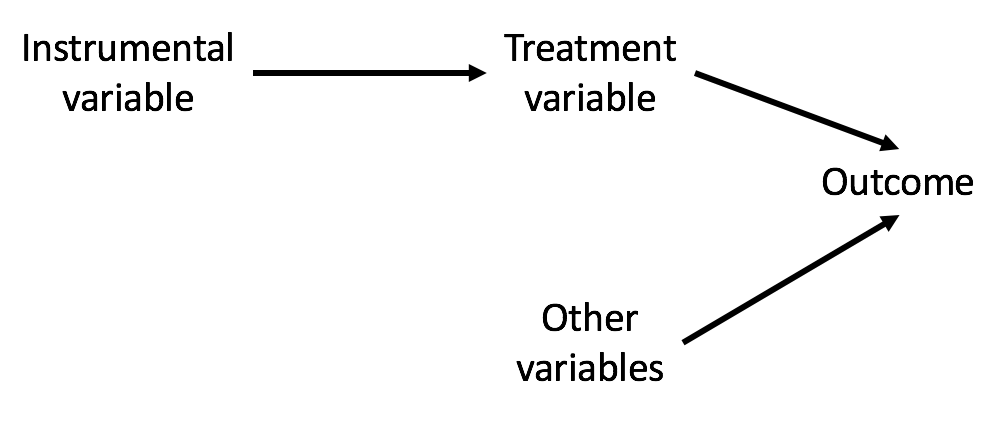

```{r global_options, include=FALSE}
knitr::opts_chunk$set(echo=FALSE, warning=FALSE, message=FALSE)
```

----

<h2 class="divider">Randomized controlled trials</h2>

## What is the purpose of randomization?

- When we randomize subjects to treatment arms, we do not **expect** any systematic differences between the groups.
- This includes both observed and unobserved covariates.
- We can always try to balance observed covariates, so the benefit of randomization is in removing the influence of unobserved covariates.

## Points to consider when evaluating RCTs

- Data quality
    - Ascertainment biases, measurement error, missing data
- Small sample sizes
    - A RCT on 20 subjects is likely not better than a larger well-designed observational study.
- SUTVA
- Generalizability
- How well did the randomization work?
    - Were the different arms actually balanced for all important confounders?
- Noncompliance
    - Do subjects actually stick to their treatment arm?

## Randomization designs

- Bernoulli randomization
- Complete randomization
- Stratified randomization
- Block randomization
- Cluster/group randomization
- Sequential randomization/adaptive designs

## Bernoulli randomization

- As subjects come in one by one, flip a coin

## Complete randomization

- Want $n_1$ subjects in treatment arm and $n_2$ in control arm
- Draw $n_1$ names from a hat and assign to treatment arm. Draw $n_2$ names and assign to control arm.

## Stratified block randomization

- List the covariates that you want to guarantee be balanced between the arms. e.g. sex, age category
- Form every possible combination of those covariates. e.g. male-old, male-young, female-old, female-young
- For each combination, generate a random sequence of balanced treatment assignments. e.g. TCTC, TTCC
- Problems
    - If investigators learn the block size (say 4) and observe TCT for the first three subjects, they know that the last subject will be C and may act differently.

## Exercise

```
library(shiny)
runGitHub("shiny_education_apps", "lmyint", subdir = "randomization")
```

- How are variance balance measures (sample size and covariates) affected with these different schemes?

## Cluster/group randomization

- Relevant especially if treatment is at a group level.
    - e.g. Classrooms randomized to teaching strategies rather than students randomized to learning strategies.
- Can help make SUTVA more reasonable
- Outcomes within a cluster are no longer independent however, so we must use different methods to compute standard errors to acouunt for this correlation.
    - e.g. "Standard errors were clustered according to household to account for intrahousehold correlation."

## Sequential randomization/adaptive designs

- Want to learn as the study progresses. e.g. In drug trials, may learn quickly that one group benefits more.

## Example: randomization design

"Oregon Health Plan Standard closed to new enrollment in 2004, but the state opened a new waiting list in early 2008 and then conducted eight random lottery drawings from the list between March and September of that year to allocate a limited number of spots. Persons who were selected won the opportunity — for themselves and any household member — to apply for Oregon Health Plan Standard. To be eligible, persons had to be..."

## Statistical analysis in RCTs

- Regression analysis: $E[\mathrm{outcome}] = \beta_0 + \beta_T\mathrm{treatment} + \beta_1 x_1 + \cdots + \beta_p x_p$
    - With randomized trials, we **expect** no difference in $x_1, \ldots, x_p$ between the treatment arms.
    - But there will still be some variation between the arms, and these predictors likely do help explain the outcome, so including them in the regression model is useful because we get a more refined estimate of the treatment effect.
- Tests for comparing two groups
    - t-tests, Wilcoxon rank sum tests
    - Tests for comparing proportions

## Generalizability: RCT design spectrum

- Efficacy trials
- Effectiveness trials
- Pragmatic trials

## Efficacy trials

- Also called "explanatory trials"
- Tries to answer: what is the effect of treatment under optimal conditions?
- Proof of concept
- Often has more stringent inclusion and exclusion criteria

## Effectiveness trials

- Treatment is delivered as it would be "in the real world"
- Gives a more realistic picture of how the treatment would work in practice

## Pragmatic trials

- Very large-scale trials
- Like effectiveness trials but enroll diverse populations and deliver "real world" versions of the treatment
- Pros: if treatment shows a positive effect, good evidence it will work in practice
- Cons: if null results, unclear if that is the truth or if this was due to the trial not being run well enough
- [PRECIS criteria](https://www.precis-2.org/) can help investigators gauge how "explanatory" or "pragmatic" their trial is.

## Compliance

 Units   Treatment assigned   Treatment received
------- -------------------- --------------------
  1             0                   0
  2             0                   0
  3             0                   1
  4             0                   1
  5             1                   1
  6             1                   1

## Various choices in dealing with non-compliance

- Intent-to-treat analysis: compare groups based on what was assigned
- As-treated analysis: compare groups based on what was received
- Per-protocol analysis: compare groups who appeared to comply with assignment
- Noncompliance can be addressed using instrumental variables approaches.


----

<h2 class="divider">Instrumental variable methods</h2>

## Idea

- Perform "natural" experiments: try to "find" a randomized trial without doing one
- Take advantage of some chance event in life that affects who gets treatments
    - This chance event is called an **instrument**.
    - In randomized trials, the instrument is the randomization mechanism.
    - Use this chance event to try to pretend as if we had done a randomized experiment
- Idea is found in both experimental and observational studies
    - We will first motivate the idea of instruments in an experimental (randomized) situation

## Randomized encouragement designs

- Useful when we can't actually randomize treatment of interest (or can't deny the program to some individuals)
- Also useful if we want to avoid noncompliance issues
- e.g. Interest in estimating effect of flu shots on hospitalizations among the elderly
    - Not ethical to randomly assign people to get flu shots or not
    - Instead, randomly assign encouragement to get flu shots (pamphlets)
    - This random encouragement is the instrument.

## Instruments can be strong or weak

Strong instrument: instrument completely determines who gets treatment

               Pamphlets   No pamphlets
------------- ----------- --------------
Got flu shot       1            0

Weak instrument: instrument somewhat influences who gets treatment

               Pamphlets   No pamphlets
------------- ----------- --------------
Got flu shot      0.3          0.2

## Assumptions about instruments

Want to be able to estimate the causal effect of flu vaccination on contracting flu. For this randomized encouragement design, we need to assume:

- **Monotonicity assumption**
    - Instrument should be positively correlated with who gets treatment.
    - Assume no "defiers", people who act opposite to the instrument.
- **Ignorability assumption**
    - Instrument is independent of unmeasured confounders
    - Happens if the instrument is randomly assigned
- **Exclusion restriction**
    - The instrument should only affect the outcomes via the treatment received.
    - The instrument should not have a direct effect on outcomes.

## Assumptions about instruments

<div align="center">

</div>

## Example: assumption evaluation

Setting: randomized encouragement (pamphlets) to get the flu shot

- **Monotonicity assumption**
    - Does the pamphlet influence whether someone gets the flu shot?
- **Ignorability assumption**
    - Is pamphlet receipt independent of unmeasured confounders? Is it randomly assigned?
- **Exclusion restriction**
    - Encouragement to get the flu shot should only influence your change of getting the flu (outcome) by acting through whether or not you get the flu shot (the treatment).
    - Could pamphlet assignment affect someone's flu outcomes by some means external to the flu shot?

## Instruments in observational studies

- In an experimental setting, randomized encouragement is an example of an instrument.
- In observational studies, we need to be more clever at identifying instruments.

## Examples of instruments

- Randomized encouragement
- Distance to specialty care provider (e.g., NICU access) to study a treatment given by that provider
- Timing of admission (e.g., weekday vs. weekend) to study a treatment given by that hospital
- Genetic variants (Mendelian randomization) to study 
- War drafts to study the effect of education on adulthood outcomes (e.g. earnings)

## Estimation of causal effects

- Treatment effect estimated is called the complier average causal effect (CACE)
    - Term makes the most sense in the context of noncompliance
- Estimation of treatment effect is most often done with a "two-stage least square" (TSLS) approach
- "Two-stage" refers to two regression models:
    1. Outcome: participation. Covariates: predictors that influence participation (including the instrument)
    2. Outcome: the outcome of interest. Covariates: predictors that influence the outcome (including the predicted participation from model 1)
