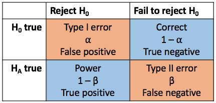

## Scientific question

Is there an association between Zika virus exposure in pregnant mothers and infant birth defects?

Is the rate of infant birth defects the same in exposed and unexposed mothers?

## Null hypothesis

The **null hypothesis** mathematically describes what we would see (data) if nothing interesing were happening.

$$ H_0: p_E - p_U = 0 $$

The **alternative hypothesis** mathematically describes something interesting. Examples include:

$$ H_A: p_E - p_U \neq 0 $$
$$ H_A: p_E - p_U > 0 $$
$$ H_A: p_E - p_U < 0 $$

We'll see how the first (non-equality) corresponds to a **two-sided hypothesis test** and how the second and third correspond to **one-sided tests**.

## Making decisions about the null hypothesis

Natural to look at an **estimate** of what we care about (the difference in birth defect rates) using some data source:

$$ \hat p_E - \hat p_U $$

$\hat p_E$: proportion of exposed mothers who have an infant with birth defects

$\hat p_U$: proportion of unexposed mothers who have an infant with birth defects

## But we don't use the estimates by themselves...

The estimate $\hat p_E - \hat p_U$ is natural but does not contain any information about the **uncertainty of the estimate**.

Let's say data source 1 gives me an estimate of 0.3. Great! Looks like a big effect.

How does our view of 0.3 change if three other data sources give me estimates of...

- 0.1, 0.5, 0.4?
- 0.31, 0.33, 0.28?

## ...we use test statistics

A test statistic generally has the form:

$$ \frac{\hbox{estimate} - \hbox{null value}}{\hbox{SE(estimate)}} $$

We can think of test statistics as being measures of evidence.

Larger (in magnitude) test statistics reflect more evidence...how large does a test statistic have to be to reject $H_0$?

## Hypothesis test outcomes

<div align="center">

</div>

We make *principled* decisions about the test statistic threshold by focusing on **controlling the type I error rate**.

Controlling the type I error rate at, say, 0.05 means that we want the probability of a type I error to be less than or equal to 0.05.

## Test statistic distributions

Use this activity to explore how estimates and test statistics vary from dataset to dataset.

```
library(shiny)
runGitHub("shiny_education_apps", "lmyint", subdir = "sampling_distributions")
```

## From test statistics to p-values

Test statistic thresholds vary from context to context. i.e. They vary despite the type I error rate being kept the same from context to context.

We can compute **p-values** from test statistics.

Interpretation of a p-value: the probability of seeing a test statistic as or more extreme than the one we have for our data, assuming that the null hypothesis is true.

The threshold for rejection of $H_0$ using p-values is the same as the type I error rate. We reject $H_0$ when the p-value is *less than* the type I error rate.

## More on p-value interpretation

Let's say that we set our type I error rate at 0.05. From our test statistic we compute a p-value of 0.02. We would reject $H_0$. Does this make sense?

Our p-value indicates that if $H_0$ were true, the probability of seeing a test statistic as or more extreme than the one we have is only 2%. i.e. The probability of seeing an evidence measure as strong or stronger than the one we have is only 2%. Proof by contradiction - see Chapter 1.

Analogy: probability that I see someone as or more wealthy than Bill Gates is really low. Bill Gates is pretty wealthy.

## One- and two-tailed tests

Interpretation of a p-value: the probability of seeing a test statistic as or more extreme than the one we have for our data, assuming that the null hypothesis is true.

What does "more extreme" mean?

## Two-tailed test

"More extreme" could mean in either direction - positive or negative

$$ H_0: p_E - p_U = 0 $$
$$ H_A: p_E - p_U \neq 0 $$

```{r fig.align="center", echo=FALSE}
x <- seq(-5, 5, 0.01)
y <- dt(x, df = 10)
critvals <- qt(c(0.025, 0.975), df = 10)
plot(x, y, type = "l", main = "Null distribution", xlab = "Test statistic", ylab = "Density")
xleft <- seq(-5, critvals[1], 0.01)
xright <- seq(critvals[2], 5, 0.01)
abline(v = critvals, col = "red", lty = "dashed", lwd = 2)
polygon(x = c(xleft, tail(xleft, 1), head(xleft, 1)), y = c(dt(xleft, df = 10), 0, 0), col = "darkorchid")
polygon(x = c(xright, tail(xright, 1), head(xright, 1)), y = c(dt(xright, df = 10), 0, 0), col = "darkorchid")
text(x = 3.5, y = 0.2, labels = "Area = 0.05", col = "darkorchid")
```

## One-tailed test

"More extreme" is in one direction only. If in the positive direction, the situation looks like this:

$$ H_0: p_E - p_U = 0 $$
$$ H_A: p_E - p_U > 0 $$

```{r fig.align="center", echo=FALSE}
critval <- qt(0.95, df = 10)
plot(x, y, type = "l", main = "Distribution of test statistic under the null hypothesis", xlab = "Test statistic", ylab = "Density")
xside <- seq(critval, 5, 0.01)
abline(v = critval, col = "red", lty = "dashed", lwd = 2)
polygon(x = c(xside, tail(xside, 1), head(xside, 1)), y = c(dt(xside, df = 10), 0, 0), col = "darkorchid")
text(x = 3.5, y = 0.2, labels = "Area = 0.05", col = "darkorchid")
```

## One-tailed test

If in the negative direction, the situation looks like this:

$$ H_0: p_E - p_U = 0 $$
$$ H_A: p_E - p_U < 0 $$

```{r fig.align="center", echo=FALSE}
critval <- qt(0.05, df = 10)
plot(x, y, type = "l", main = "Distribution of test statistic under the null hypothesis", xlab = "Test statistic", ylab = "Density")
xside <- seq(-5, critval, 0.01)
abline(v = critval, col = "red", lty = "dashed", lwd = 2)
polygon(x = c(xside, tail(xside, 1), head(xside, 1)), y = c(dt(xside, df = 10), 0, 0), col = "darkorchid")
text(x = 3.5, y = 0.2, labels = "Area = 0.05", col = "darkorchid")
```

## When to use one- vs two-tailed?

- Two-tailed tests: don't know a priori if the difference should be positive or negative.
    - We might *feel* that the difference $p_E - p_U$ should be positive, but we don't know for sure. Best to use a two-tailed test.
- One-tailed tests: know for sure that the difference is of a certain sign.
    - Rarely happens that we **know** what the sign will be
    - e.g. Delayed login button. Number of clicks must be >= 1.
- Potential for "cheating": one-tailed tests correspond to lower test statistic thresholds
    - It is "easier" to obtain statistically significant results with one-tailed tests.

## Power

We have been focusing on type I error. Trying to lower type II error is the same as trying to maximize power. How can we do this?

For type I error, we looked at how test statistics vary under $H_0$ (if $H_0$ were true).

For power, we need to look at how test statistics vary under $H_A$ (if $H_A$ were true).

$$ H_A: p_E - p_U \neq 0 $$
$$ H_A: p_E - p_U > 0 $$
$$ H_A: p_E - p_U < 0 $$

The center of the distribution could be anywhere (not zero)! That is infinitely many possibilities to consider!

## Why does science proceed the way it does?

<div align="center">

</div>

[Vaccines: Last Week Tonight with John Oliver](https://youtu.be/7VG_s2PCH_c?t=708)

## Power exploration

```
library(shiny)
runGitHub("shiny_education_apps", "lmyint", subdir = "power")
```

The activity in the first tab examines how different factors affect power.

## What affects power?

Power increases with

- Increasing type I error rate
- Increasing sample size
- Decreasing underlying variability in the population
- Increasing value of the true difference (called **effect size**)

Do these make sense?

## Power increases with increasing type I error rate?

Why would increasing error also increase power?

Example: Questionable decision procedure

- Always reject $H_0$ no matter what
- This test has 100% power!
- But it also has 100% type I error!

There is a tradeoff between type I error and power.

## Interpreting diagnostic tests

Prevalence = 0.1

Sensitivity = 0.8 = $P(T+ \mid D+)$

Specificity = 0.7 = $P(T- \mid D-)$

             Test +   Test -
----------- -------- -------- ------
 Disease -
 Disease +
                               1000

## Interpreting power

How should we interpret rejection of failure to reject $H_0$ in light of power and type I error? The activity in the second tab explores this.

```
library(shiny)
runGitHub("shiny_education_apps", "lmyint", subdir = "power")
```

## Common statistical tests: continuous

Comparing continuous values in two groups

- t-test
    - Assumes independent observations
    - Assumes the values come from a normal distribution or...
    - Assumes large enough sample sizes in each group (~20 each)
- Wilcoxon rank sum test
    - Assumes independent observations

## Common statistical tests: categorical

Testing for an association between two dichotomous variables

- Chi-squared test
    - Assumes independent observations
    - Assumes adequate cell counts (counts in contingency table) (~5 each)
- Fisher's exact test
    - Assumes independent observations

## Common statistical tests

How do these tests perform (in terms of type I error and power) under different situations?

```
library(shiny)
runGitHub("shiny_education_apps", "lmyint", subdir = "common_tests")
```

## Confidence intervals

We've used test statistics and p-values to make decisions about rejecting $H_0$.

But what if I'm simply interested in expressing the uncertainty of my estimate with a range of plausible values?

General form for a confidence interval:

$$ \hbox{estimate} \pm k \times \hbox{SE(estimate)} $$

What should $k$ be? It depends on our desired confidence level.

## Confidence intervals

$$ \hbox{estimate} \pm k \times \hbox{SE(estimate)} $$

For a confidence level of $100\times (1-\alpha)\%$, $k$ is the test statistic threshold.

This confidence level is also called the **coverage probability** of the interval, typically set at 95%. If this procedure to construct a CI is meeting expectations, we expect that over many different datasets, using this procedure will result in intevals where 95% of them contain the true value of interest (true difference in birth defect rates).

## Confidence intervals

Can you think of a 100% confidence interval?

Important point regarding interpretation: the coverage probability/confidence level of a CI describes the quality of the CI creation *procedure*. Viewing a CI as a reasonable set of values for the true quantity of interest must be contingent on knowing the procedure used to create the CI.

There are good and bad procedures. Here's a bad 95% CI creation procedure:

- 5% of the time, say $(10,10)$
- 95% of the time, say $(-\infty, \infty)$

## Confidence interval exploration

Different methods for creating CIs make different assumptions about the distribution of the data. In the following activity, we can compare their performance under different situations.

```
library(shiny)
install.packages("Hmisc") ## Run this line if you run into an error with runGitHub below
runGitHub("shiny_education_apps", "lmyint", subdir = "confidence_intervals")
```
