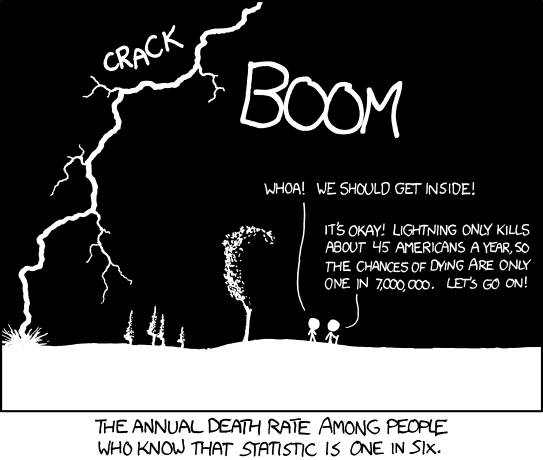

## From research to media

[Scientific Studies: Last Week Tonight with John Oliver](https://www.youtube.com/watch?v=0Rnq1NpHdmw)

----

<h2 class="divider">The video does address...</h2>

## Publication bias

Scientific studies may be subtly/strongly biased because scientists feel pressured to come up with eye-catching positive results.

## Peeking and tweaking

It is possible to tweak your study and analysis to get the desired results:

- Adjust length of the study
- Collect a sample that is too small to be reliable
- "p-hacking": fiddling with your modeling approach to get a statistically significant result
    - [Interactive demo on FiveThirtyEight](https://fivethirtyeight.com/features/science-isnt-broken/)

## Replication

Even well-designed studies can give incorrect results.

- We protect against the impact of this with replication studies.
- It is never one study that proves an idea. Evidence needs to accumulate over time.
    - [How do we know that smoking causes cancer?](http://www.cancer.org/latest-news/the-study-that-helped-spur-the-us-stop-smoking-movement.html)
- "There's no Nobel prize for fact checking."
    - With the way the research system is set up now, replication studies are not incentivized.

## Media distortion

Original research is often distorted by the time we hear about it.

- Press releases can exaggerate findings of a study.
- Translating results on animal models to conclusions for humans is tenuous.
- Even though there may be disagreement in the scientific literature, the media reports on a study with exciting results and doesn't give context about the state of the literature.
- Part of the blame may be on us, the news consumers. It's more interesting to read about something unexpected.

## Framing expectations

Scientists and journalists don't always do a good job of framing expectations.

- "We found X!" Is X actually interesting?
- "Anyone is more open to anything when they're not hungry!"
- Idea of having controls in a scientific experiment

## Sample size

- Low sample sizes make for unreliable estimates.
- They also suggest low generalizability of study findings.

## Conflict of interest

- If a company funds certain research, we should be wary of ulterior motives.
- This is still a concern in purely academic research.
    - Politics of scientific discoveries can make researchers more prone to act in certain ways.

----

<h2 class="divider">The video doesn't address...</h2>

## Data collection

- Analysis principle: "trash in = trash out"
- Statistics cannot save poor data quality
    - Self-report
    - Measurement technologies
    - Record completeness

## Study design and statistical analysis

- What is the day-to-day procedure of how studies will be run?
- How does this determine what statistical methods can be used to analyze the data?

## Statistical power

If there were actually something to find, do I even have a hope of finding it with my study population?

## Variable selection

I have hundreds of variables that might be associated with breast cancer severity. How do I sift through these to find the relvant ones?

## Causal inference

I want to know the causal effect of this new exercise regime on bone density. How can I go about doing this?

## Surveys

I want to conduct a public opinion survey but am worried because there are so many moving parts! How should I write the questions? How can I make sure I target the right populations and minimize nonresponse rates?

## Survival analysis

I am studying how different factors influence age of onset of dementia. In my study, I'm following people over time but am running into the hitch that people are dropping out. Is there a way to handle this?

## Longitudinal analysis

I want to study how blood biomarkers change over time in subjects with diabetes and other medical and environmental factors affect these concentrations. I'd like to use a regression approach but know that those methods assume independence of observations, which is clearly not the case here. What do I need to be aware of when looking at this type of data?

## Statistical thinking

- Thinking like a scientist
    - Our one burning desire is to find truth/answer a question.
    - Acknowledge the potential pitfalls at every stage of the study.
    - Think deeply about measurement and data collection.
- Thinking like a statistician
    - Being aware of statistical ideas to know what methods are appropriate and why.
    - Our interest is usually in estimating effects. Estimation falls under the realm of statistics.
    - What assumptions do we make when using different methods? Are they reasonable?
    - Many different ways to analyze data. Want to be able to defend our approach(es).

## Fun with statistics

[Source](http://www.stat.tamu.edu/~richard/assets/images/conditional-risk-543x460-1.png)

## Fun with statistics

- Feel free to find or make cartoons or the like related to class content and share them
- Feel free to share news articles that relate to class concepts

## Next class

- Discussion of data collection and quality
- Read the following two news articles:
    - [Your flu risk may be linked to the year you were born](http://www.cnn.com/2016/11/10/health/flu-risk-birth-year/)
    - [Get Off The Couch Baby Boomers, Or You May Not Be Able To Later](http://www.npr.org/sections/health-shots/2017/09/04/547580952/get-off-the-couch-baby-boomers-or-you-may-not-be-able-to-later)
- Pay attention to data collection and quality and make some notes. Nothing to turn in.
