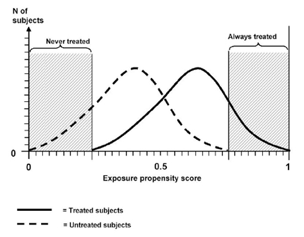

```{r global_options, include=FALSE}
knitr::opts_chunk$set(echo=FALSE, warning=FALSE, message=FALSE)
```

# Survival Analysis

## Key features

- Collect data longitudinally and outcome is the **time to an event**
- Time to event data can be discrete or continuous data that are **censored**
    - Important idea: what is the **time metric**? How should time be defined?
- Goals of survival analysis are to
    - Estimate and compare survival over time (survival functions) for groups of interest
    - Estimate the effect of covariates on survival
- Comparison to other approaches
    - Logistic regression: treating failure as a binary event ignores time information
    - Linear regression: treating time-to-event as a continuous variable ignores censoring information

## Types of censoring

- Right-censoring
- Left-censoring
- Interval-censoring
- Type I censoring
- Type II censoring

## Right-censoring

True survival time is greater than or equal to the observed survival time.

- Data collection stops at a prespecified time.
- Subject withdraws from study or is lost to follow-up before the failure.

```{r}
par(mar = c(4.5,4,0.2,1))
plot(1, type = "n", xlim = c(0,10), ylim = c(0,6), yaxt = "n", xlab = "Year", ylab = "Individuals")
segments(x0 = c(0,0,0,1,2), y0 = 5:1, x1 = c(3,4,4,8,5), lwd = 4)
segments(x0 = 8, y0 = 2, x1 = 10, lwd = 4, lty = "dashed", col = "gray50")
points(x = c(0,0,0,1,2), y = 5:1, pch = 16, cex = 2)
points(x = c(3,8), y = c(5,2), pch = 1, cex = 2)
points(x = c(rep(4,2),5,10), y = c(4,3,1,2), pch = "X", cex = 2)
abline(v = c(8,8), col = c("red", "blue"), lty = "dashed")
text(x = 7, y = 0.25, labels = "End of study", col = "blue")
text(x = 2.25, y = 5.25, labels = "Dropout")
text(x = c(1.75,6.75), y = c(4.75,1.75), labels = "Right-censored", col = "red")
```

## Left-censoring

True survival time is less than or equal to the observed survival time.

- Disease detection occurs after physiological onset. e.g. Flu infection has occurred before you start to get a fever.

```{r}
par(mar = c(4.5,4,0.2,1))
plot(1, type = "n", xlim = c(0,10), ylim = c(0,2), yaxt = "n", xlab = "Year", ylab = "Individuals")
segments(x0 = 0, x1 = 7, y0 = 1, lwd = 4)
points(x = c(5,7), y = c(1,1), pch = "X", cex = 2, col = c("red", "black"))
text(x = c(5,7), y = c(0.75,1.25), labels = c("Infection onset", "Infection detection"), col = c("red", "black"))
```

## Interval censoring

True survival time is between two known times

- Disease is detected between regular follow up visits

```{r}
par(mar = c(4.5,4,0.2,1))
plot(1, type = "n", xlim = c(0,10), ylim = c(0,2), yaxt = "n", xlab = "Year", ylab = "Individuals")
segments(x0 = 0, x1 = 7, y0 = 1, lwd = 4)
points(x = c(3,5,7), y = rep(1,3), pch = "X", cex = 2, col = c("black", "red", "black"))
text(x = c(3,5,7), y = c(1.25,0.75,1.25), labels = c("No infection detection", "Infection onset", "Infection detection"), col = c("black", "red", "black"))
```

## Type I censoring

True survival time is greater than a pre-determined cutoff

- Special case of right censoring
- Also called administrative censoring (administrative end of the study)

## Type II censoring

Study stops when the $k$ subjects experience failure. The remaining subjects are censored.

- Can occur in product testing

## Assumptions about censoring

- Typical survival analyses make the following assumptions regarding censoring:
    - Random
    - Independent
    - Non-informative
- Of these, independent censoring is the most important to verify/think about.
- Generally these assumptions are untestable because we don't observe the actual survival time of the censored individuals

## Assumptions about censoring

- Random censoring
    - Split your subjects randomly into any number of groups. Within each of these groups, we **assume** that the failure rates are the same in the censored and uncensored individuals.
- Independent censoring
    - If we have random censoring within each level of any **covariate**, we say that we have independent censoring.
- Non-informative censoring
    - Occurs if the survival times don't provide information about the censoring times and vice-versa

## Importance of independent censoring

Usually survival analyses compare the survival of two or more groups. In this case, independent censoring allows for unbiased estimates of these differences. Why?

ex) Clinical trial of a new drug vs placebo

- Placebo users might drop out if they do not see their health changing.
- These censored subjects may be less healthy than the other subjects.
- If we assume independent censoring, we would assume that these censored subjects are just as healthy as the uncensored placebo subjects.
- This could cause us to underestimate the effect of the drug because we assume that the placebo groups is more healthy that it truly is.

## Statistical tools

- Functions of interest
    - Survivor function: probability of survival past a time $t$: $S(t) = P(T > t) = 1 - F(t)$
    - Hazard function: instantaneous rate of failure at time $t$ given survival up to time $t$: $h(t) = \lim_{\Delta t \to 0} \frac{P(t \leq T < t+\Delta t \mid T \geq t)}{\Delta t}$
- Kaplan-Meier estimation is used to estimate the survival function
    - Uses censoring information but incorporation of covariate information is limited to computing estimates in different strata
- Cox regression is used to model the hazard function
    - Allows for estimation of covariate effects on survival
    - Does not make a parametric assumption about the distribution of survival times
    - Using the Cox proportional hazards model assumes that hazard for any two individuals is proportional over time (hazard ratio function is flat) - so no time-varying covariates
    - Time-varying covariates can be handled with the extended Cox model

## Other ideas

- Special methods exist for
    - Recurrent events
    - Competing risks
- Survival studies have the potential for
    - Immortal time bias
    - Lenth bias
    - Lead time bias
- For understanding the above biases, it is always helpful to pretend as if some treatment had no effect. Under these biases, how might we mis-estimate the treatment effect.

# Survey Analysis

## Overview of items to think about

Background

- What are the goals of the survey?

Survey design

- How were people sampled?
- What information was collected and how?

Total survey error

- Error introduced by the random process of sampling
- Non-sampling errors: nonresponse, measurement error, information bias

## Survey design: terminology

- How do we obtain a representative sample and select randomly from it?
- A **sampling frame** is the object that we actually use to draw a sample.
    - e.g. phonebook, database (such as the US Postal Service's Delivery Sequence File)
    - If the sampling frame is not representative of the population to which we want to generalize, then we have representation/coverage error.
- If we specify/know the probability of drawing each unit into our sample, we have a **probability sample**.
- In a **non-probability sample**, we do not know the probability of selection into the survey.
    - e.g. Convenience, quota, snowball sampling
- Statisticians like probability samples because unbiased estimators are readily available (assuming no nonresponse and other measurement problems)

## Sampling designs

Depending on the nature of the scientific question and the available population, different sampling **procedures** may be used. While a sampling frame gives information on the units available, a sampling design specifies **how** we sample those units.

- Simple random sampling: every unit in the sampling frame has the same probability of being selected
- Stratified sampling: target subgroups equally by sampling within strata
    - Estimate variability can be improved over just stratifying after simple random sampling
- Cluster sampling: sample clusters of lower-level units such as states, school districts, schools, classrooms. All units in the cluster are taken.
    - Done out of necessity if individual-level sampling frames are not available. Also for resource reasons
    - Responses will likely be correlated within the cluster
- Multi-stage sampling: similar to cluster sampling, but we sample units within each cluster
    - Based on the nature of sampling frames available, it can be more feasible to perform sampling in stages
    - e.g. NHANES

## Estimation

- Goals: estimate a mean, total, proportion overall and within subgroups
- Simple approach: calculate the sample mean and sample proportion, use regression
- Better approach: incorporate information from the sampling design in the form of **survey weights** (weighted averages, weighted regression)
    - From the previous sampling designs, we know/can calculate the probability of sampling each unit (in a clean situation with no nonresponse).
    - These probabilities give rise to **survey weights**.
    - Weights are related to the inverse probability of being sampled.
    - Weight calculations are also influenced by generalizability considerations (subjectivity!).

## Oversampling and post-stratification

- If we want to get an accurate estimate of a measure within a typically underrepresented subgroup (a stratum), we may want to oversample this group relative to its true proportion in the population.
    - e.g. If patients with a rare disease make up 1% of the population, we won't get a very precise (low variability) estimate of average activity (steps/day) if we let them be 1% of our sample. We must sample them more heavily to get a more accurate and precise estimate.
- Account for oversampling a stratum with **post-stratification weighting**.
    - This requires knowing the true proportions of the subgroups within the population.
    - e.g. census, US Current Population Survey
    - Post-stratification weighting generally describes the process of up- or downweighting units so that the sample more closely resembles the target population.

## Components of total survey error

Total survey error describes all of the possible errors that can affect our estimate of the quantitiy of interest.

<div style="text-align: center">

</div>

[Reference](https://link.springer.com/referenceworkentry/10.1007%2F978-94-007-0753-5_3034)

# Causal Inference

## Ways to think about causality

- Rubin causal model
    - Treatments: interventions
    - Units: entities to which interventions are applied or withheld
    - Potential outcomes: "parallel universe" outcomes unter the treatment versions
- Bradford-Hill criteria

Overarching goal in causal inference is estimation of treatment effects.

## Treatment effects

- Average treatment effect (ATE): average effect for everyone in the population
    - Generally applies to beneficial interventions
- Average treatment effect for the treated (ATT): average effect for only those treated
    - Generally applies to harmful interventions

## SUTVA

- The Stable Unit Treatment Value Assumption (SUTVA) has two parts:
    1. No interference between units: treatment assignment of one unit does not affect potential outcomes of another unit
        - Drug use of one person doesn't affect someone else's outcomes
    2. Treatment only has one version
        - "Heavy" drug use doesn't have distinct subcategories such as "very heavy" or "moderately heavy"
- We care about SUTVA because we want a well-defined treatment whose effect we can estimate cleanly.

## Randomized controlled trials

In RCTs, study units are randomly assigned to the treatment or control condition. What does this imply about the links in the causal diagram?

<div style="text-align: center">

</div>

$$ P(T \mid X, Y(0), Y(1)) = P(T \mid X) $$

This property is known as **unconfounded treatment assignment**. For this reason, RCTs are said to be the gold standard for assessing causal effects. However, RCTs are not so clean in real life and sometimes aren't ethical.

## Points to consider when evaluating RCTs

- SUTVA
- Data quality
    - Ascertainment biases, measurement error, missing data
- Small sample sizes
    - A RCT on 20 subjects is likely not better than a larger well-designed observational study.
- Generalizability
    - Where does the trial fall on the realm between efficacy and pragmatic?
- How well did the randomization work?
    - Were the different arms actually balanced for all important confounders and sample size?
- Noncompliance
    - Do subjects actually stick to their treatment arm?

## Interrupted time series

- How does the time trend of an outcome change after a policy is introduced?
- Comparative ITS: look at a control population not exposed to the outcome
- Is there a discontinuity near the time of the intervention?
    - Variety of modeling techniques used to address this
    - Estimation of trends before and after the intervention should be pretty accurate and their uncertainty appropriately quantified

## Instrumental variables

- Often unethical or infeasible to perform a randomized experiment
- Idea: find a natural experiment where there is a chance event that randomly dictates what treatment you receive
- Assumptions regarding instruments:
    - Instrument should be positively correlated with who gets treatment
        - **Monotonicity assumption**: assume no "defiers", people who act opposite to the instrument
    - Instrument should be randomly assigned
        - Implicit in this is that the instrument is independent of unmeasured confounders
    - The instrument should only affect the outcomes through the treatment received. Also called the **exclusion restriction**.
- Two-stage least squares is used to estimate the treatment effect

## Matching methods

- Idea: want individuals who are identical except for their treatment assignment. Attempting to get counterfactual outcome
- Methods:
    - Exact matching
    - Coarsened exact matching
    - Distance-based matching
    - Propensity scores

## Propensity scores

**Definition**: probability of receiving the treatment given the observed covariates (often estimated with logistic regression)

$$ \mathrm{Propensity\:score} = e_i = P(T_i = 1 | X_i) $$

Two key features:

1. Balancing score: At each value of the propensity score, the distribution of observed covariates (that went into the propensity score) is the same in the treated and control groups
    - We check balance of covariates with measures such as standardized differences.
2. If treatment assignment is independent of potential outcomes given covariates (**unconfounded treatment assignment**), then it is also independent of potential outcomes given the propensity score (assuming no unmeasured confounders).
    - This property allows us to match on the propensity score alone - don't need to match on all covariates individually.

## Propensity scores can be used in many ways

- Matching
    - Match treated and untreated individuals based on similarity of propensity scores
    - With this, we expect that we're balancing measured and unmeasured confounders
- Weighting
    - Use propensity scores to compute weights for individuals - how much information should each unit contribute to the estimation of the treatment effect?
- Subclassification/stratification
    - Make a small number of groups where all units in a group fall into the same propensity score range
- Inclusion as a covariate in a model
    - Generally I've seen recommendations against this

## Common support/overlap condition

- Idea: everyone needs to have a positive probability of receiving either treatment
- Exclude controls who would never be treated and treated who would never be controls
    - For these individuals, we would never know their counterfactual outcome

<div style="text-align: center">

</div>

# Miscellaneous

## Other ideas

- "P-hacking": fiddling with data to achieve desired results
- Multiple testing: testing many different hypotheses increases chance that one will be significant just by chance
- Hypothesis testing
    - One vs two-tailed tests: certain vs. uncertain about effect direction
    - Power: probability of rejecting the null hypothesis if it really is not true
        - Depends on significance level, effect size, and estimate variability

## Other ideas

- Generalized linear models
    - Allows regression for different types of data: continuous, binary, categorical, count
- Variable selection in regression
- Imputation: filling in missing data
    - Multiple imputation for doing this many times to capture uncertainty of the filling in process
- Extrapolation: don't predict beyond the range of your data
- Tests
    - Fisher's exact test and chi-squared test for tesing independence
    - t-tests and Wilcoxon rank sum tests for comparing continuous values in two groups
