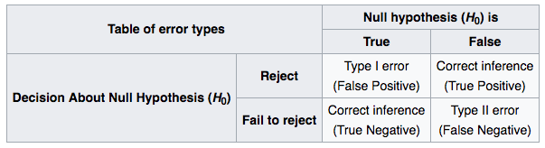
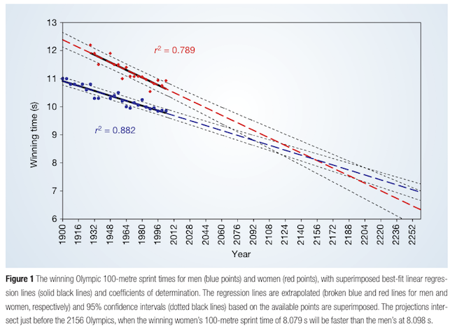

```{r global_options, include=FALSE}
knitr::opts_chunk$set(echo=FALSE, warning=FALSE, message=FALSE)
library(scales)
```

# Prenatal and Infant Exposure to Thimerosal From Vaccines and Immunoglobulins and Risk of Autism

## Research question

- Is there an association between ethylmercury exposure during various time periods and risk of autism spectrum disorder (ASD), autistic disorder (AD), and ASD with regression?
- What has already been done in the literature?
    - "Most previous research has not revealed an increased risk of autism associated with receipt of thimerosal-containing vaccines. Evidence is limited, however, on the timing of vaccination, especially prenatal exposure, and associations with different subtypes of autism."

## Primmary data source

- 3 managed care organizations (MCOs) within the CDC's Vaccine Safety Datalink
- Why were those 3 MCOs chosen?
    - "The Vaccine Safety Datalink (VSD) project is a collaborative project between the Centers for Disease Control and Prevention and 8 man-aged care organizations (MCOs) in the United States."
    - Baggs, James, Julianne Gee, Edwin Lewis, Gabrielle Fowler, Patti Benson, Tracy Lieu, Allison Naleway, et al. 2011. "The Vaccine Safety Datalink: A Model for Monitoring Immunization Safety." Pediatrics 127 Suppl 1 (May): S45–53. doi:10.1542/peds.2010-1722H.
    - [CDC's VSD website](https://www.cdc.gov/vaccinesafety/ensuringsafety/monitoring/vsd/)

## Study design: pre-specifying protocol

"The study protocol was developed before data collection in consultation with a panel of external consultants that included autism advocates and experts in autism, child development, toxicology, epidemiology, biostatistics, and vaccine safety. All subgroup analyses and interaction tests were specified in the study protocol before data collection."

Why is it important to specify the protocol for data collection and analysis before the study begins?

## Study design: matched case control design

- Why is a matched case control design useful?
- The control to case ratio was targeted to be 3 to 1. What is the importance of having multiple controls per case?

```{r}
library(survival)

set.seed(1)
fits <- lapply(1:5, function(ratio) {
	do.call(rbind, lapply(seq_len(100), function(i) {
		# 2000 baseline log odds for each stratum
		baselineLogOdds <- rep(rnorm(2000, mean = -1.4, sd = 0.1), each = ratio+1)
		pairID <- rep(seq_len(2000), each = ratio+1)
		## Set truth
		beta1 <- 0.3
		## Simulate exposure status
		exposed <- rbinom(2000*(ratio+1), size = 1, prob = 0.2)
		## Calculate probability of disease
		logOdds <- baselineLogOdds + beta1*exposed
		odds <- exp(logOdds)
		p <- odds/(1+odds)
		## Simulate disease status
		disease <- rbinom(2000*(ratio+1), size = 1, prob = p)

		diseaseMat <- matrix(disease, ncol = ratio+1, byrow = TRUE)
		pairIDmat <- matrix(pairID, ncol = ratio+1, byrow = TRUE)
		exposedMat <- matrix(exposed, ncol = ratio+1, byrow = TRUE)
		## Which strata have one diseased person? (Rest are controls)
		ccpairs <- which(rowSums(diseaseMat)==1)
		npairs <- 100
		## Select the first 100
		index <- head(ccpairs, npairs)

		df <- data.frame(dis = as.numeric(diseaseMat[index,]),
			id = as.numeric(pairIDmat[index,]),
			expo = as.numeric(exposedMat[index,]))
		clogfit <- clogit(dis ~ expo + strata(id), data = df)
		summary(clogfit)$coefficients
	}))
})
ses <- lapply(fits, function(mat) { mat[,3] })
boxplot(ses, xlab = "Control:case ratio", ylab = "SE(log odds ratio)", main = "SEs from simulated matched case-control studies")
```

## Study design: matched case control design {.smaller}

```{r echo=TRUE, eval=FALSE}
library(survival)
set.seed(1)
fits <- lapply(1:5, function(ratio) {
	do.call(rbind, lapply(seq_len(100), function(i) {
		# 2000 baseline log odds for each stratum
		baselineLogOdds <- rep(rnorm(2000, mean = -1.4, sd = 0.1), each = ratio+1)
		pairID <- rep(seq_len(2000), each = ratio+1)
		## Set truth
		beta1 <- 0.3
		## Simulate exposure status
		exposed <- rbinom(2000*(ratio+1), size = 1, prob = 0.2)
		## Calculate probability of disease
		logOdds <- baselineLogOdds + beta1*exposed
		odds <- exp(logOdds)
		p <- odds/(1+odds)
		## Simulate disease status
		disease <- rbinom(2000*(ratio+1), size = 1, prob = p)
```

## Study design: matched case control design {.smaller}

```{r echo=TRUE, eval=FALSE}
		diseaseMat <- matrix(disease, ncol = ratio+1, byrow = TRUE)
		pairIDmat <- matrix(pairID, ncol = ratio+1, byrow = TRUE)
		exposedMat <- matrix(exposed, ncol = ratio+1, byrow = TRUE)
		## Which strata have one diseased person? (Rest are controls)
		ccpairs <- which(rowSums(diseaseMat)==1)
		npairs <- 100
		## Select the first 100
		index <- head(ccpairs, npairs)

		df <- data.frame(dis = as.numeric(diseaseMat[index,]),
			id = as.numeric(pairIDmat[index,]),
			expo = as.numeric(exposedMat[index,]))
		clogfit <- clogit(dis ~ expo + strata(id), data = df)
		summary(clogfit)$coefficients
	}))
})
ses <- lapply(fits, function(mat) { mat[,3] })
boxplot(ses, xlab = "Control:case ratio", ylab = "SE(log odds ratio)",
	main = "SEs from simulated matched case-control studies")
```

## Study subjects

- Are the inclusion and exclusion criteria reasonable?
    - Children were excluded if they had certain medical conditions with known links to ASD traits. Why?
- Obtaining controls
    - Multiple sampling stages were used to select controls: "Consent was requested...for a randomly selected sample of controls that were matched to case-children within birth year, gender, and MCO matching strata. This sampling stage resulted in a pool of controls with physician consent (Fig 1). As case-children were confirmed as eligible and enrolled as study participants, random samples of matched controls were selected for recruitment from the pool of controls."
    - Given that participants had to be recruited into the study over time, the investigators used this approach to avoid selection bias

## Outcomes

- How was case status ascertained?
    - "Mothers of case-children were administered the Autism Diagnostic Interview-Revised (ADI-R),12 and case-children were directly assessed by using the Autism Diagnostic Observation Schedule (ADOS)."
    - Key idea: all cases were verified to be cases in the same way
- Why is it important that the assessors were blinded?
    - "Assessors were blinded with respect to the thimerosal exposure status of the child and mother."
- How was control status ascertained?
- Why did the authors look at three different autism-related outcomes?
    - Addresses the concern that negative results could be due to incorrect diagnosis or merging unique effects for different disease subtypes

## Predictors: outcome ascertainment

- How was postnatal ethylmercury exposure ascertained?
    - "Children’s histories of TCI receipts were obtained from computerized immunization records and abstracted medical charts. Mercury content of the TCIs was determined by linking the manufacturer, lot number, and year of receipt information to published data and manufacturer records."
- How was prenatal ethylmercury exposure ascertained?
    - "Maternal receipt of immunoglobulins, tetanus toxoids, and diphtheria-tetanus during pregnancy was primarily ascertained from medical charts (81 receipts) and less often from maternal interviews (6 receipts). Maternal receipt of flu vaccine during pregnancy was infrequently recorded in medical charts (2 receipts) and primarily came from maternal report (36 receipts)."

## Predictors: defining exposure

- "We defined postnatal exposure as micrograms of ethylmercury divided by the weight of the child (in kilograms) at the time of administration of each TCI. Exposures were summed over the time periods of interest. Prenatal exposure was defined as the cumulative ethylmercury amount (in micrograms) of all TCIs received by the mother during her pregnancy with the child."
- Key idea: defining mercury exposure involved a **choice**/an **assumption** on the part of the researchers that the best way to quantify exposure was by adding up the individual exposures

## Predictors 

- What other covariates were considered for adjustment in the statistical models? Are these reasonable? How well were they ascertained?
    - "Covariates tested for inclusion in the statistical models were child and family characteristics...; maternal exposures during pregnancy...; child birth conditions...; early-childhood health conditions...; and maternal health care–seeking behavior...."
- Are there other highly important covariates that could have been left out?

## Statistical analysis: conditional logistic regression

- Why was conditional logistic regression used as opposed to ordinary logistic regression?
    - In a matched case-control study, each set (stratum) of matched case(s) and control(s) are formed by matching on certain characteristics except for the quantity of interest. (Why wouldn't you match cases and controls by ethylmercury exposure?)
    - If those characteristics are related to risk of the outcome, then each stratum has its own baseline log odds of the outcome.
    - We don't care about this baseline log odds. All we care about is how the odds change with the quantitiy of interest (mercury exposure).

## Statistical analysis: conditional logistic regression

```{r}
set.seed(1)
n <- 10
yints <- runif(n, min = 1, max = 6)
slope <- 0.5
xend <- 4
yends <- yints + slope*xend
plot(1, type = "n", xlim = c(0, xend), ylim = range(yints, yends), xlab = "Quantity of interest", ylab = "Log odds")
segments(x0 = 0, y0 = yints, x1 = xend, y1 = yends)
points(x = rep(0, n), y = yints)
points(x = rep(xend, n), y = yends)
```

## Statistical analysis: conditional logistic regression

- If ordinary logistic regression were used, we would need a model such as:

$$ \log\left(\frac{p}{1-p}\right) = \beta_1\mathrm{stratum}_1 + \beta_2\mathrm{stratum}_2 + \cdots + \beta_k\mathrm{stratum}_k + \beta_\mathrm{merc}\mathrm{merc} $$

- It turns out that $\hat\beta_\mathrm{merc}$ is biased in this case: $E[\hat\beta_\mathrm{merc}]-\beta_\mathrm{merc} \neq 0$.
- Conditional logistic regression obviates the need for the stratum-specific indicator variables and gives a much less biased estimate of $\beta_\mathrm{merc}$

## Statistical analysis

- "Models were fit with and without covariates." Why was this done?
    - Fitting a model "with covariates" means that potential confounders that were measured are "adjusted for".
    - Fitting a model "without covariates" (but including only the quantity of interest) gives unadjusted measures of association. Why would we ever want an unadjusted measure?
        - Unadjusted measures are useful in their own right for telling us what things affect the outcome
        - e.g. Outcome: cancer risk. Predictors: age, smoking status. Of course, it is imperative to adjust for age, but the unadjusted coefficient for smoking gives us easily recallable information for making quick decisions.

## Statistical analysis: choosing covariates

- Often we have a lot of potential predictors, but we don't know which ones to include in the model
- When this happens, researchers typically use a **variable selection** procedure
- This is the motivation behind the "change-in-estimate" criterion used to choose which covariates were included in the final model
    - "Covariates were retained in the final models if they satisfied a change-in-estimate criterion evaluated by dropping terms that resulted in a 􏰀<10% change in exposure coefficients relative to a full model with all potential covariates."
- To understand what this procedure is doing, we need to understand how coefficients in a regression model can change depending on the other predictors included

## Statistical analysis: choosing covariates

Recall: coefficients can change substantially depending on what other predictors are included.

Example: data simulated from the regression model

$$ E[Y] = 1 + 1.5 x_1 + 2 x_2 $$

What happens when we only include $x_1$?

## Statistical analysis: choosing covariates {.smaller}

```{r}
set.seed(1)
n <- 200
x1 <- rgamma(n, shape = 2, scale = 2)
x2 <- rgamma(n, shape = 2, scale = 2)
y <- 1 + 1.5*x1 + 2*x2 + rnorm(n, mean = 0, sd = 3)
df <- data.frame(y = y, x1 = x1, x2 = x2)
summary(lm(y ~ x1, data = df))
```

## Statistical analysis: choosing covariates {.smaller}

What happens to the coefficient for $x_1$ when we also include $x_2$?

```{r}
summary(lm(y ~ x1+x2, data = df))
```

## Statistical analysis: choosing covariates

- In the previous simulation example, we **know** that both $x_1$ and $x_2$ are important.
- Because $x_2$ is important, we see a "reasonably noticeable" change in the coefficient for $x_1$
- In this paper, the authors included all predictors and focused on the change in the mercury exposure coefficient when dropping each predictor in turn
    - Idea: if the predictor that was dropped is relevant in predicting autism risk, the exposure coefficient will change "enough" (> 10%). That signals that it should be included in the final model.

## Statistical analysis: choosing covariates (code)

```{r echo=TRUE, eval=FALSE}
set.seed(1)
n <- 200
x1 <- rgamma(n, shape = 2, scale = 2)
x2 <- rgamma(n, shape = 2, scale = 2)
y <- 1 + 1.5*x1 + 2*x2 + rnorm(n, mean = 0, sd = 3)
df <- data.frame(y = y, x1 = x1, x2 = x2)
summary(lm(y ~ x1, data = df))
summary(lm(y ~ x1+x2, data = df))
```

## Statistical analysis

- Why were odds ratios presented in two forms?
    - "To facilitate interpretation of results, we present ORs in 2 forms. The first is the OR associated with an increase of 1 unit of exposure, in which 1 unit equals 1 􏰄g of ethylmercury for prenatal exposure or 1 􏰄g of ethylmercury per kilogram of body weight for postnatal exposure. The second, which is used as an indication of the difference between low and high exposure, is the OR for a difference in exposure equal to 2 SDs for each particular exposure measure of interest."

## Statistical analysis: statistical significance

- "All tests were 2-tailed, and statistical significance was set at P < .05." What does this mean?
- Recall the outcomes of a statistical hypothesis test:

<div style="text-align: center">

</div>

## Statistical analysis: statistical significance

Three ways to test a hypothesis:

- Compute a test statistic and reject if a threshold is exceeded
- Compute a confidence interval for the estimate and reject if the null value is not in the confidence interval
- Compute a p-value and reject if the p-value is less than a threshold

The thresholds and the width of the confidence interval depend on the value of the type I error rate (denoted $\alpha$) which we set before the study (typically at 0.05).

## Statistical analysis: statistical significance

- Generally, test statistics can be written as:

$$ \mathrm{test\_statistic} = \frac{\mathrm{estimate}-\mathrm{null\_value}}{\mathrm{SE(estimate)}} $$

- Note: everything here except for the null value is a random variable. So this test statistic has a **distribution**.
- Importantly, the test statistic has a distribution "under the null hypothesis" and "under the alternative hypothesis."
    - If I repeated my experiment many times and computed this test statistic, and **if the null hypothesis were true**, then what would the distribution of these statistics look like?
    - If I repeated my experiment many times and computed this test statistic, and **if the null hypothesis were NOT true**, then what would the distribution of these statistics look like?

## Statistical analysis: statistical significance

```{r fig.height=4.5}
x <- seq(-5, 5, 0.01)
y <- dt(x, df = 10)
plot(x, y, type = "l", main = "Distribution of test statistic under the null hypothesis", xlab = "Test statistic", ylab = "Density")
```

## Statistical analysis: statistical significance

Recall that the interpretation of the **p-value** is the probability of seeing a test statistic as or more extreme "under the null hypothesis."

p-values are a measure of discrepancy of the data from the null model.

Whether a test is one or two-tailed depends on our prior notions of the effect direction and impacts how the p-value is calculated.

## Statistical analysis: statistical significance

For a two-tailed test:

$$ H_0: \mathrm{difference} = 0 $$
$$ H_A: \mathrm{difference} \neq 0 $$

```{r fig.height=4}
critvals <- qt(c(0.025, 0.975), df = 10)
plot(x, y, type = "l", main = "Distribution of test statistic under the null hypothesis", xlab = "Test statistic", ylab = "Density")
xleft <- seq(-5, critvals[1], 0.01)
xright <- seq(critvals[2], 5, 0.01)
abline(v = critvals, col = "red", lty = "dashed", lwd = 2)
polygon(x = c(xleft, tail(xleft, 1), head(xleft, 1)), y = c(dt(xleft, df = 10), 0, 0), col = "darkorchid")
polygon(x = c(xright, tail(xright, 1), head(xright, 1)), y = c(dt(xright, df = 10), 0, 0), col = "darkorchid")
text(x = 3.5, y = 0.2, labels = "Area = 0.05", col = "darkorchid")
```

## Statistical analysis: statistical significance

For a one-tailed test:

$$ H_0: \mathrm{difference} = 0 $$
$$ H_A: \mathrm{difference} > 0 $$

```{r fig.height=4}
critval <- qt(0.95, df = 10)
plot(x, y, type = "l", main = "Distribution of test statistic under the null hypothesis", xlab = "Test statistic", ylab = "Density")
xside <- seq(critval, 5, 0.01)
abline(v = critval, col = "red", lty = "dashed", lwd = 2)
polygon(x = c(xside, tail(xside, 1), head(xside, 1)), y = c(dt(xside, df = 10), 0, 0), col = "darkorchid")
text(x = 3.5, y = 0.2, labels = "Area = 0.05", col = "darkorchid")
```

## Statistical analysis: statistical significance

For a one-tailed test:

$$ H_0: \mathrm{difference} = 0 $$
$$ H_A: \mathrm{difference} < 0 $$

```{r fig.height=4}
critval <- qt(0.05, df = 10)
plot(x, y, type = "l", main = "Distribution of test statistic under the null hypothesis", xlab = "Test statistic", ylab = "Density")
xside <- seq(-5, critval, 0.01)
abline(v = critval, col = "red", lty = "dashed", lwd = 2)
polygon(x = c(xside, tail(xside, 1), head(xside, 1)), y = c(dt(xside, df = 10), 0, 0), col = "darkorchid")
text(x = 3.5, y = 0.2, labels = "Area = 0.05", col = "darkorchid")
```

## Statistical analysis: power

Statistical power is the probability of detecting an association **given that there truly is an association**. While p-values require us to know the distribution of the test statistic "under the null", calculating power requires us to know the distribution "under the alternative".

The gray lines indicate the test statistic thresholds (two-tailed) for rejection for a type I error rate $\alpha = 0.05$. The gray area is equal to to $\alpha$.

```{r}
x <- seq(-5, 8, 0.01)
y <- dt(x, df = 10)
y2 <- dt(x, df = 10, ncp = 1)
plot(x, y, type = "l", main = "Distribution of test statistic", xlab = "Test statistic", ylab = "Density")
lines(x, y2, col = "red")
legend("topright", legend = c("Under null", "Under alternative"), col = c("black", "red"), lty = "solid", bty = "n")
critvals <- qt(c(0.025, 0.975), df = 10)
abline(v = critvals, col = "gray50", lty = "dashed")
xleft <- seq(-5, critvals[1], 0.01)
xright <- seq(critvals[2], 8, 0.01)
polygon(x = c(xleft, tail(xleft, 1), head(xleft, 1)), y = c(dt(xleft, df = 10), 0, 0), col = alpha("gray50", 0.5))
polygon(x = c(xright, tail(xright, 1), head(xright, 1)), y = c(dt(xright, df = 10), 0, 0), col = alpha("gray50", 0.5))
text(x = 5, y = 0.2, labels = paste0("alpha = ", 1-diff(pt(critvals, df = 10))), col = "gray50")
```

## Statistical analysis: power

Because the thresholds (gray lines) indicate when we reject the null, we can look at the pink area underneath the alternative distribution (red) to calculate power.

```{r}
x <- seq(-5, 8, 0.01)
y <- dt(x, df = 10)
y2 <- dt(x, df = 10, ncp = 1)
plot(x, y, type = "l", main = "Distribution of test statistic", xlab = "Test statistic", ylab = "Density")
lines(x, y2, col = "red")
legend("topright", legend = c("Under null", "Under alternative"), col = c("black", "red"), lty = "solid", bty = "n")
critvals <- qt(c(0.025, 0.975), df = 10)
abline(v = critvals, col = "gray50", lty = "dashed")
xleft <- seq(-5, critvals[1], 0.01)
xright <- seq(critvals[2], 8, 0.01)
polygon(x = c(xleft, tail(xleft, 1), head(xleft, 1)), y = c(dt(xleft, ncp = 1, df = 10), 0, 0), col = alpha("deeppink", 0.5))
polygon(x = c(xright, tail(xright, 1), head(xright, 1)), y = c(dt(xright, ncp = 1, df = 10), 0, 0), col = alpha("deeppink", 0.5))
text(x = 5, y = 0.2, labels = paste0("Power = ", round(1-diff(pt(critvals, ncp = 1, df = 10)), 2)), col = "deeppink")
```

## Statistical analysis: power

- "posthoc calculations indicate that the study had ~80% power to detect ORs of 1.5, 1.7, 2.1, and 2.2"
- To calculate power, we need to know, set, or make some assumptions regarding:
    - Effect magnitude (how big is the difference?)
    - Variability of effect estimate (need sample size)
    - Significance level (type I error rate)
- [Interactive visualization of power](http://rpsychologist.com/d3/NHST/)
- This study conducted posthoc power calculation so they did not need to guess the variability of effect estimate - they could just compute it.
- Watch out for: how reasonable are the assumed effect magnitudes? Be wary of high power to detect "easy" (large) effects

## Statistical analysis: interaction terms

- The authors tested interaction terms in their models. What do interaction terms model?
    - "In addition, by adding model terms to test for interactions, we examined whether the effect of postnatal thimerosal exposure on the risk of the 3 ASD outcomes was modified by the gender of the child, concurrent antibiotic use, or prenatal thimerosal exposure."
    - Interaction terms tell us how effects (slopes) differ between different groups
    - How does the effect of mercury exposure on autism risk differ between genders? Between concurrent and non-concurrent antibiotic users? Between children with $x$, $y$, and $z$ prenatal thimerosal exposure?
- Try writing down some logistic regression models that the authors might have fit that contain some of these interaction terms.

## Statistical analysis: sensitivity analyses

- In what situations might sensitivity analyses be useful?
    - Evaluating inclusion and exclusion criteria
    - Unusual or extreme observations present
    - Data from different sources with potentially different reliability or generalizability implications

## Statistical analysis: sensitivity analyses

- Were any sensitivity analyses performed?
    - "For example, results from fitting models separately to data from the 2 largest MCOs showed that the exposure estimates in both were similar to the overall results. We found no evidence that the results were sensitive to extreme exposure amounts, extreme residual values, or were being driven by a few unusual individuals. We further determined that modeling exposure measures as linear terms was appropriate. Use of postnatal exposure variables that were not divided by the child’s weight at the time of vaccine receipt did not change our findings. Exclusion of low birth weight children from the analyses resulted in only a slight attenuation of exposure effects toward 0."

## Results: reading a "Table 1"

- Almost always in association study articles, Table 1 compares demographic information between the main comparison groups
- Each demographic variable will also show a p-value from a test comparing the groups
- Unless the demographic variables are the quantities (treatments) of interest, then any significant differences could indicate potential confounding

## Results: reading a "Table X"

- Later tables (Table 3 in this study) in association study articles typically list the results from unadjusted and adjusted models. (Why do we care about unadjusted results?)
- Items to look for:
    - Confidence intervals (do they overlap the null value?)
    - How wide are the intervals?
    - How much do the adjusted and unadjusted results differ?
    - Are the estimates clinically/practically significant?

# Thimerosal exposure in infants and neurodevelopmental disorders: An assessment of computerized medical records in the Vaccine Safety Datalink

## Research question

- Is there an association between average mercury dose by birth year and autism-related neurodevelopmental disorder rates by birth year?
- How does this question relate to what has already been done in the literature?
    - "It is important to note that the National Research Council of the US National Academy of Science in 2000 determined that there is a causal relationship between childhood methylmercury exposure and neurodevelopmental disorders."
    - [National Academies Press report](https://www.nap.edu/read/9899/chapter/8#p200032fcppp250)

## Study design

- Why did the authors use an ecological study design as opposed to using individual level data? How does this impact the utility of the results?
    - "Because the study protocol did not permit us to match data across vaccine files, exposure was determined in aggregate by birth cohort for each vaccine and then summed across the birth cohorts."

## Study subjects

- Why did the authors use a cutoff for birth date?
    - "Only those individuals who had a non-missing date of birth and were born before January 1, 1997 were examined. This date was chosen to allow for at least 4 years of follow-up for each member of the cohort which was believed to be an adequate amount of time to observe the outcomes of interest."
- Why did they only look at individuals who had the oral polio vaccine?
    - "The oral polio vaccine file was chosen because this vaccine was the only vaccine that was consistently administered to all children during the time period of 1990–1996, which is the time period of this study."
- Main idea: the authors need a case count (numerator) and size of population at risk (denominator) to compute the outcome (prevalence). Are they doing this well?

## Outcomes: disorders examined

- Why did the authors look at neurodevelopmental disorders and control disorders?
    - Idea: having controls in a scientific experiment
    - If we have an association between average mercury exposure and neurodevelopmental disorder prevalence, is it just because average mercury exposure is associated with many things?

## Outcomes: ascertainment of disorder status

- "The outcome files (inpatient and outpatient diagnoses) from this population were then reviewed to find the first instance of diagnosis of the disorders of interest. If there were multiple instances of the same diagnosis in a child, only the first instance was counted."
    - Did the multiple diagnoses agree?
    - Are the multiple diagnoses are informative? e.g. Are these diagnoses more definitively determined?
    - How uniform were the criteria used to make the diagnoses across patients?

## Outcomes: case counting

- Why did the authors make adjustments for case counts in 1995 and 1996? Is this reasonable?
    - "Because of concern that the cohorts from 1995–1996 had only 4–6 years of follow-up, frequency distributions of age at diagnosis were examined for all years. This revealed that for some of the disorders a sizable proportion of children were diagnosed after 4.5 years. Adjustments were made for counts of cases as needed for birth cohorts depending upon the disorder examined to correct for under ascertainment that occurred due to shorter follow-up times. These adjustments were made for all disorders including the control disorders as appropriate based on the age distribution."

## Statistical technique: imputation

Imputation is a technique that is used to fill in missing data values

- Reasonably justified to fill in covariate values if observed complete data is sufficiently "close by"

```{r}
df <- data.frame(age = c(12,15,40,45), skateboard = c(TRUE,TRUE,FALSE,NA))
df
```

## Statistical danger: extrapolation

```{r}
x <- seq(1, 5, 0.2)
y <- x^2 - 6.8
y[x <= 3] <- x[x <= 3]
plot(x[x <= 3], y[x <= 3], xlim = range(x), ylim = range(y), xlab = "Predictor", ylab = "Outcome")
abline(a = 0, b = 1)
```

## Statistical danger: extrapolation

```{r}
plot(x, y, col = rep(c("black", "red"), times = c(sum(x <= 3), sum(x > 3))), xlim = range(x), ylim = range(y), xlab = "Predictor", ylab = "Outcome")
abline(a = 0, b = 1)
```

## Statistical danger: extrapolation

[Momentous sprint at the 2156 Olympics?](http://www.nature.com/doifinder/10.1038/431525a)

<div style="text-align: center">

</div>

## Outcomes: case counting

The authors in this study impute **outcomes**: "Adjustments were made for counts of cases as needed for birth cohorts depending upon the disorder examined to correct for under ascertainment that occurred due to shorter follow-up times. These adjustments were made for all disorders including the control disorders as appropriate based on the age distribution."

- Very dubious because there is no data to support this imputation
- Akin to extrapolation

## Predictors

- How were mercury exposures from the different vaccines ascertained?
    - "The routine childhood vaccines of interest were Haemophilus Influenza Type b (Hib), hepatitis B vaccine, acellular Diphtheria–Tetanus–acellular-Pertussis (DTaP), and whole-cell Diphtheria–Tetanus–Pertussis (DTP) vaccines. The following Hg content from Thimerosal, as detailed by the US FDA [12], were assumed for the following routine childhood vaccines under study: Hib = 25 micrograms (ug) Hg/dose, DTaP/DTaPH = 25 ug Hg/dose, whole-cell DTP/ DTPH = 25 ug Hg/dose, and hepatitis B = 12.5 ug Hg/dose."
- What other covariates were considered for adjustment in the statistical models?
    - None!

## Statistical analysis: Poisson regression

- "Poisson regression analysis was used to model the association between prevalence of event of interest and Hg dose."
- Poisson regression is a regression technique that is used to study how different factors affect a count outcome
- Standard technique for modeling incidence and prevalence rates
- Problem with this study was that the unit of analysis was a birth cohort
    - This results in only 7 data points (1990-1996)

# Zika virus articles in JAMA and NEJM

## Research question

- NEJM: What is the difference in adverse birth outcome rates in women with and without Zika infection during the first 6 to 39 months of gestation?
- JAMA: "To estimate the preliminary proportion of fetuses or infants with birth defects after maternal Zika virus infection by trimester of infection and maternal symptoms."
    - Here we are focused on estimating birth defect rates in pregnant women infected with Zika, but in light of studies like the NEJM one, this study can be useful for further characterizing the situation.

## Key points regarding data

- What biases could affect what types of women had the chance to be enrolled?
    - JAMA: US Zika Pregnancy Registry
    - NEJM: Adaptation of a dengue surveillance effort. Pregnant women who presented with a rash at an acute febrile illness clinic
- What were the additional inclusion and exclusion criteria?

## Key points regarding data: exposures

- How was information collected regarding the actual presence of and timing of Zika infection?
    - JAMA
        - 5 confirmatory laboratory tests are mentioned but the authors call their exposures "possible Zika infection" because "the USZPR also includes mother-infant pairs with serological evidence of a recent unspecified flavivirus infection."
        - "The gestational timing of Zika virus infection for symptomatic pregnant women was based on maternal report of date of symptom onset; for asymptomatic pregnant women, timing was based on the trimester of exposure (travel to an area of active Zika virus transmission or sexual exposure)."
    - NEJM
        - Use RT-PCR to detect the virus in blood and urine
        - Since PCR was used only after women were presenting with symptoms, we only know that exposure was sometime before they came in.
- What are some reasons for why timing of infection could be important to know?

## Key points regarding data: outcomes

- How were birth defects determined?
    - JAMA: "The included birth defects were based primarily on case reports of outcomes occurring in association with Zika virus infection during pregnancy...Clinical experts reviewed reported information to ensure each infant with birth defects met the above criteria."
    - NEJM: Study team took infant measurements at birth and also performed imaging studies but weren't blinded for the latter: "All infant assessments were conducted with knowledge of ZIKV infection status."
- Both articles group together several types of birth defects into one outcome. Why?

## Statistical analysis: CI for a proportion

$$ \hat p \pm 1.96 \sqrt{\frac{\hat p (1-\hat p)}{n}} $$

- This confidence interval calculation relies on an approximation that is valid only when $n$ is large enough relative to $\hat p$ (roughly $n\hat p \geq 5$)
- If that assumption isn't satisfied, then the "95% confident" will likely be less than 95%
    - This property of confidence intervals is called the **coverage probability**
- The [Wilson score interval](https://en.wikipedia.org/wiki/Binomial_proportion_confidence_interval#Wilson_score_interval) uses a different formula for the CI that allows the approximation assumption to be relaxed and still have a more correct coverage probability.

## Statistical analysis: Fisher's exact test

- NEJM: Women who were positive for Zika virus with PCR were compared to those who were negative in terms of demographic and clinical variables using Fisher's exact test.
- Fisher's exact test assesses the independence of two categorical variables
- In the following two examples, I simulated data where (1) there is no association between Zika infection and presence of a fever and (2) where there is an association

```{r}
set.seed(1)
zikv <- sample(c("pos", "neg"), size = 200, replace = TRUE)
fever <- sample(c("yes", "no"), size = 200, replace = TRUE)
fever2 <- ifelse(zikv=="pos", rbinom(200, size = 1, prob = 0.9), rbinom(200, size = 1, prob = 0.1))
fever2[fever2==1] <- "yes"
fever2[fever2=="0"] <- "no"
tab1 <- table(zikv, fever)
tab2 <- table(zikv, fever2)
```

## Statistical analysis: Fisher's exact test

```{r}
rbind(cbind(tab1, rowSums(tab1)), c(colSums(tab1), sum(tab1)))
fisher.test(tab1)
```

## Statistical analysis: Fisher's exact test

```{r}
rbind(cbind(tab2, rowSums(tab2)), c(colSums(tab2), sum(tab2)))
fisher.test(tab2)
```

## Statistical analysis: other tests

- NEJM: "For comparison of medians, an independent-samples median test was used. Comparisons of negative pregnancy outcomes according to maternal trimester of infection between ZIKV-infected and ZIKV-uninfected mother-infant pairs were compared with the use of McNemar's test."
- A median test is a test similar to a t-test for comparing the means of two groups. Instead the medians are compared
- McNemar's test is like Fisher's exact test in that it assess the independence of two variables but the variables are paired
    - In this study, the authors wanted to know, if the mother has some adverse outcome, will the child also have an adverse outcome?
