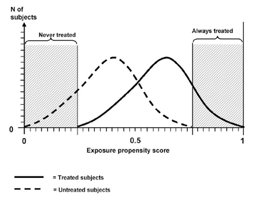

```{r global_options, include=FALSE}
knitr::opts_chunk$set(echo=FALSE, warning=FALSE, message=FALSE)
```

## Study designs in causal inference

- Randomized trials: break the link between potential outcomes and treatment assignment
- Interrupted time series: take advantage of the introduction of a policy to compare outcomes before and after
- Regression dicontinuity: take advantage of some cutoff that determines who gets treated
- Matching studies: as much as possible, replicate a randomized trial by comparing units that are as similar as possible other than the treatment
- Natural experiments (instrumental variables): take advantage of some chance event in life that affects who gets treatments

# Randomized trials

## What is the purpose of randomization?

When we randomize subjects to treatment arms, we do not **expect** any systematic differences between the groups.

- This includes both observed and unobserved covariates.
- We can always try to balance observed covariates, so the benefit of randomization is in breaking the influence of unobserved covariates.

## Randomization strategies

Bernoulli (coin flip)

- As subjects come in one by one, flip a coin
- Problems
    - Potential for very uneven sample sizes in the treatment arms
    - Potential for chance imbalance in prespecified important covariates

## Randomization strategies

Complete randomization

- Want $n_1$ subjects in treatment arm and $n_2$ in control arm
- Draw $n_1$ names from a hat and assign to treatment arm. Draw $n_2$ names and assign to control arm.
- Problems
    - Potential for chance imbalance in prespecified important covariates

## Randomization stratgies

Stratified block randomization

- List the covariates that you want to guarantee be balanced between the arms. e.g. sex, age category
- Form every possible combination of those covariates. e.g. male-old, male-young, female-old, female-young
- For each combination, generate a random sequence of balanced treatment assignments. e.g. TCTC, TTCC
- Problems
    - If investigators learn the block size (say 4) and observe TCT for the first three subjects, they know that the last subject will be C and may act differently.

## Randomized trial caveats

- Evaluate the randomization strategy and if it worked well based on tables of characteristics
- Were the patients and/or investigators blinded?
- How extensive was noncompliance?
- Is SUTVA reasonable? (One version of treatment and no interaction between units)
- Where does the trial fit on the spectrum of explanatory to pragmatic?

# Interrupted time series

## What is the study design?

- What is the effect of an intervention (often a policy) on an outcome?
- Policy is introduced at some time point and we want to compare the time trends of the outcome before and after

## Details

- Need a statistical model for time trend pre-intervention
- Assume that it continues smoothly onward in absence of intervention
- Presence of a discontinuity around the intervention gives evidence for intervention effect
    - If pre- and post-intervention trends flow smoothly together, hard to say that there is an intervention effect

# Matching studies

## Idea

- We want to compare apples to apples so we only want individuals who are identical except for their treatment assignment
- Individuals that we can't match are too different to include in the analysis
    - We don't have a good idea of the counterfactual for these individuals

## Matching methods

- Exact matching
- Coarsened exact matching
- Distance-based matching
- Propensity scores

## Exact matching

- For each treated individual, find a control who matches on all other covariates.
- Very difficult even with a moderate number of covariates

## Coarsened exact matching

- "Coarsen" covariates to make them easier to match on
- e.g. Instead of exact matching on age, match age categories exactly
- Makes it easier to find matches

## Distance-based matching

- Compute a distance between the covariate values of all individuals and match each individual to the individuals with the smallest distance
- Common distance metric is the **Mahalanobis distance**:

$$ d(x,y) = \sqrt{(x-y)^T S^{-1} (x-y)} $$

- $S$ is a covariance matrix so this metric measures the distance between two sets of covariate values $x$ and $y$ in variability units

# Propensity score methods

## Idea

- Want to look at treated and control groups that have similar covariate values
- Instead of matching on each covariate, use a summary measure of the covariate values

## Propensity scores

- **Definition**: probability of receiving the treatment given the observed covariates

$$ \mathrm{Propensity\:score} = e_i = P(T_i = 1 | X_i) $$

- Two key features:
  1. Balancing score: At each value of the propensity score, the distribution of observed covariates (that went into the propensity score) is the same in the treated and control groups
  2. If treatment assignment is independent of potential outcomes given covariates (**unconfounded treatment assignment**), then it is also independent of potential outcomes given the propensity score (assuming no unmeasured confounders)

## Feature 1: propensity scores as balancing scores

- At each value of the propensity score, the distribution of observed covariates (that went into the propensity score) is the same in the treated and control groups.
- Intuitively, if two people had the same probability of receiving the treatment (e.g., becoming heavy drug users) and one did and one didn't, it must have been random as to who did and who didn't.
- Within small range of propensity score values, treated and comparison individuals should look only randomly different on the observed covariates.
- In practice, need to check the similarity of covariate values in these propensity score bins

## Numerical summaries of balance

- Most common: standardized bias or standardized difference
    - Difference in means of the covariate in the treatment and control groups divided by a standard deviation
    - The SD can be over all treated and controls or just one of the groups. Key idea is to use the same number before and after matching for a fair comparison

$$ B = \frac{\bar X_t - \bar X_c}{\sqrt{\sigma_x^2}} $$

## Feature 2: unconfoundedness

- If unconfoundedness holds given the full set of observed covariates, it also holds given the propensity score. In other words:

$P(T \mid X, Y(0), Y(1)) = P(T \mid X)$ (unconfounded treatment assignment) implies

$P(T \mid X, Y(0), Y(1)) = P(T \mid e(X))$ (unconfoundedness given the propensity score $e(X)$)

- This property allows us to match on the propensity score alone - don't need to match on all covariates individually.

## Common support/overlap condition

- Idea: everyone needs to have a positive probability of receiving either treatment
- Exclude controls who would never be treated and treated who would never be controls
    - For these individuals, we would never know their counterfactual outcome

<div style="text-align: center">

</div>

Schneeweiss S. Developments in post-marketing comparative effectiveness research. Clin Pharmacol Ther 2007 Aug;82(2):143-56.

## Estimating propensity scores

- Any method for modeling the probability of a categorical event (treatment is usually binary)
- Logistic regression is most commonly used

## Using propensity scores

- $k$-nearest neighbor matching
    - For each treated subject, find the $k$ controls with the closest propensity score
- Subclassification/stratification
    - Make a small number of groups where all units in a group fall into the same propensity score range
- Use propensity scores as weights
    - ATE estimation: weight all subjects to look the combined population (to look like an "average person")
    - ATT estimation: weight controls to look like treated subjects

Any of the above approaches are nearly always used with regression - gain benefit of regression adjustment and comparable groups

## References

- [Matching methods for causal inference: A review and a look forward](https://www.ncbi.nlm.nih.gov/pmc/articles/PMC2943670/)
- [Using Propensity Scores to Help Design Observational Studies: Application to the Tobacco Litigation](https://link.springer.com/article/10.1023/A:1020363010465)

# Instrumental variable methods

## Idea

- Perform "natural" experiments: try to "find" a randomized trial without doing one
- Take advantage of some chance event in life that affects who gets treatments
    - This chance event is called an **instrument**.
    - In randomized trials, the instrument is the randomization mechanism.
    - Use this chance event to try to pretend as if we had done a randomized experiment
- Idea is found in both experimental and observational studies
    - We will first motivate the idea of instruments in an experimental (randomized) situation

## Randomized encouragement designs

- Useful when we can't actually randomize treatment of interest (or can't deny the program to some individuals)
- Also useful if we want to avoid noncompliance issues
- e.g. Interest in estimating effect of flu shots on hospitalizations among the elderly
    - Not ethical to randomly assign people to get flu shots or not
    - Instead, randomly assign encouragement to get flu shots (pamphlets)
    - This random encouragement is the instrument.

## Instruments can be strong or weak

Strong instrument: instrument completely determines who gets treatment

               Pamphlets   No pamphlets
------------- ----------- --------------
Got flu shot       1            0

Weak instrument: instrument somewhat influences who gets treatment

               Pamphlets   No pamphlets
------------- ----------- --------------
Got flu shot      0.3          0.2

## Assumptions about instruments

Want to be able to estimate the causal effect of flu vaccination on contracting flu. For this randomized encouragement design, we need to assume:

- Instrument should be positively correlated with who gets treatment
    - **Monotonicity assumption**: assume no "defiers", people who act opposite to the instrument
- Instrument should be randomly assigned
    - Implicit in this is that the instrument is independent of unmeasured confounders
- The instrument should only affect the outcomes through the treatment received. Also called the **exclusion restriction**.
    - Encouragement to get the flu shot should only influence your change of getting the flu (outcome) by acting through whether or not you get the flu shot (the treatment).
    - If encouragment to get the flu shot prompts you to adopt other healthy behaviors (like extra hand washing), this would be a violation of this assumption.

## Instruments in observational studies

- We've been discussing randomized encouragement as an instrument
- In observational studies, all the same assumptions about instruments apply
    - We just need to be more clever at identifying instruments

## Examples of instruments

- Randomized encouragement
- Distance to specialty care provider (e.g., NICU access)
- Timing of admission (e.g., weekday vs. weekend)
- Genetic variants (Mendelian randomization)

## Estimation of causal effects

- Treatment effect estimated is called the complier average causal effect (CACE)
    - Term makes the most sense in the context of noncompliance
- Estimation of treatment effect is most often done with a "two-stage least square" (TSLS) approach
- "Two-stage" refers to two regression models
    1. Outcome: participation. Covariates: predictors that influence participation (including the instrument)
    2. Outcome: the outcome of interest. Covariates: predictors that influence the outcome (including the predicted participation from model 1)

## Why TSLS and not other regressions?

- $Y = \beta_0 + \beta_1\mathrm{Instrument}$
    - Intent-to-treat analysis: compares those **assigned** to treatment and control
    - Unbiased estimate of effect of randomization but not what we're interested in
- $Y = \beta_0 + \beta_1\mathrm{TreatmentReceived}$
    - As-treated analysis: compare the people who actually received the treatment with those who actually received the control
    - Biased estimate of treatment effect because compliers and noncompliers are likely different from each other
- $Y = \beta_0 + \beta_1\mathrm{TreatmentReceivedFollowedDirections}$
    - Per-protocol analysis: Compares the outcomes of those people who appeared to comply with their assigned treatment
    - Biased estimate of treatment effect because compliers and noncompliers are likely different from each other

## Two-stage least squares

Stage 1: Predict the treatment that the subjects would have been assigned in a randomized experiment setting.

- Data used to fit the model:
    - Outcomes: treatment received
    - Predictors: instrument and other observed covariates that affect treatment received

Stage 2: Use this predicted treatment assignment as a predictor in a regression model with the actual outcome of interest.

- Data used to fit this model:
    - Outcomes: actual health outcomes
    - Predictors: predicted treatment received from model 1 and other observed covariates that affect the health outcome

Turns out that treatment effect estimated from TSLS has a nice statistical property called consistency under certain assumptions about the instrument.

## Example

Research question: what is the effect of drug X on health outcomes?

Instrument: physician prescribing preferences

Evalute the instrument:

- Instrument should be positively correlated with who gets treatment
    - Assume no "defiers"
- Instrument should be randomly assigned
    - Instrument is independent of unmeasured confounders
- The instrument should only affect the outcomes through the treatment received.

## Example

Stage 1: Predict the drug that the subjects would have been assigned had this been a randomized experiment.

- Data used to fit the model:
    - Outcomes: drug actually received
    - Predictors: physician preference (instrument) and other observed covariates that affect the drug received (costs, availability)

Stage 2: Use this predicted drug assignment as a predictor in a regression model with the actual outcome of interest (health outcomes).

- Data used to fit this model:
    - Outcomes: health outcomes
    - Predictors: predicted drug received from model 1 and other observed covariates that affect the health outcome (age, sex, weight)

## Noncompliance

- The two-stage least squares approach can also be used to address noncompliance in randomized trials.
- Instrument: randomization mechanism
    - Positively correlated with who gets treatment and we assume no defiers.
    - Is randomly assigned by definition
    - Likely only affects outcome through the treatment actually received
- Stage 1: Predict the treatment received based on the instrument (the treatment randomly assigned)
- Stage 2: Regression with outcome of interest and the predicted treatment
- Coefficient for treatment estimates the average treatment effect among compliers

## References

- [Econometrics in outcomes research: the use of instrumental variables](http://isites.harvard.edu/fs/docs/icb.topic79832.files/L03_Risk_adjustment_2/Newhouse.IVestimation.AnnRevPublicHealth.1998.pdf)
- [Estimating intervention effects of prevention programs: Accounting for noncompliance](https://www.ncbi.nlm.nih.gov/pmc/articles/PMC2921838/)
- [Instrumental variable methods for causal inference](https://www.ncbi.nlm.nih.gov/pmc/articles/PMC4201653/)
