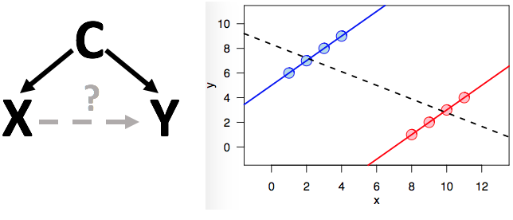

```{r global_options, include=FALSE}
knitr::opts_chunk$set(echo=FALSE, fig.width=10)
```

## Goal: learning about the world

Our understanding about the world is all about understanding inputs and outputs.

What are the **effects** of inputs on outputs?

Once a clear question is put forth, a statistical approach to learning about effects is to **estimate** them.

<div class="notes">
An imprecise question: what is the relationship between smoking and lung cancer?
Both smoking and lung cancer need to be quantifiable
To understand statistical estimation, we have to review the concept of random variables
</div>

# Random variables | <span style="text-decoration: underline">**distributions**</span>, probability, likelihood

## Variables

How is the variable $X$ different in these two situations?

$$ X = \hbox{age of next person who walks through the door} $$

$$ \hbox{Age when finished grad school} = \hbox{age now} + X $$

## Random variables

**Random variables** are variables that can take a range of possible values because of some random process.

Contrast with an algebraic variable whose value is fixed given an associated equation

## Random variables

The defining property of a random variable is its **distribution function**. This function tells us how likely different sets of values are.

Discrete random variables can take countably many values, and their distribution function is called a **probability mass function** written as:

$$ p(x) = P(X = x) $$

Continuous random variables take uncountably many values, and their distribution function is called a **probability density function** written as:

$$ f(x) \qquad \mathrm{where} \qquad P(X \in A) = \int_A f(x)\,dx $$

## Random variables

Random variables are denoted by capital letters, and their **realizations** (observed values) are denoted by lowercase letters.

$$ X = \hbox{outcome of a 6-sided dice roll} $$
$$ x = 4 $$

When we collect data, we represent our observations as a set of random variables: $X_1,\ldots,X_n$.

Important to keep in mind: what parts of our data do we represent as random variables and what parts do we represent as fixed?

## Mean and variance

The mean is a measure of the center of a distribution:

$$
\begin{align}
E[X] &= \sum_{x \in S} x p(x) \qquad\qquad \mathrm{discrete} \\
E[X] &= \int_{S} x f(x)\,dx \qquad \mathrm{continuous}
\end{align}
$$

Variance is a measure of how disperse the distribution is:

$$
\begin{align}
\mathrm{Var}(X) &= \sum_{x \in S} (x-E[X])^2 p(x) \qquad\qquad \mathrm{discrete} \\
\mathrm{Var}(X) &= \int_{S} (x-E[X])^2 f(x)\,dx \qquad \mathrm{continuous}
\end{align}
$$

where $S$ is the set of values that the random variable $X$ can take.

## Example: binomial distribution

$$ X \sim \mathrm{Binomial}(n,p) $$
$$ p(x) = P(X = x) = \binom{n}{x}p^x (1-p)^{n-x} $$
$$ E[X] = np \qquad \mathrm{Var}(X) = np(1-p)$$

```{r fig.width=8, fig.height=3.6}
par(mar = c(5,4,0.1,2))
barplot(dbinom(0:10, size = 10, prob = 0.3), names.arg = 0:10, xlab = "x", ylab = "p(x)")
```

<div class="notes">
Ask if p(1-p) looks familiar
</div>

## Example: normal distribution

$$ X \sim N(\mu, \sigma) $$
$$ f(x) = \frac{1}{\sqrt{2\pi\sigma^2}}\exp\left( -\frac{(x-\mu)^2}{2\sigma^2} \right) $$
$$ E[X] = \mu \qquad \mathrm{Var}(X) = \sigma^2 $$

```{r fig.width=8, fig.height=3.6}
par(mar = c(5,4,0.1,2))
x <- seq(-4,4,0.01)
plot(x, dnorm(x, mean = 0, sd = 1), type = "l", xlab = "x", ylab = "f(x)")
```

## Important distributions

Discrete

- Bernoulli and binomial: binary outcomes
- Multinomial: categorical outcomes
- Poisson: count data
- Negative binomial: count data with higher variability

Continuous

- Normal (Gaussian) and its relatives: $t$, $F$, $\chi^2$
- Exponential: rare/extreme outcomes

<div class="notes">
These distributions are well known and useful because they serve as useful **models** for many situations in real life. Not every distribution in real life is one of these, but most of the time these are pretty good approximations.
</div>

## Modeling real data with familiar distributions

Distributions of real quantities can be arbitrarily messy. We use known distributions as building blocks to model real world data.

```{r}
set.seed(1)
x <- c(rnorm(100), rbeta(400, 0.5, 0.5), runif(300, -3, 2), rnorm(200, -1.5))
plot(density(x), xlab = "x", main = "Probability distribution function")
```

## Known distributions: what's the use?

Why do we care if a quantity follows, say, a normal distribution?

The normal distribution has two **parameters** ($\mu$ and $\sigma$) that completely determine the density function.

- If we can figure out what the values of $\mu$ and $\sigma$ are, we know a lot!

## Known distributions: what's the use?

Two caveats with using known distributions

- When we have data, we almost never know that it comes from a certain distribution
    - Can use exploratory plots and goodness of fit tests to guess
- Even if we have a guess, it's almost certainly not exactly true
    - "All models are wrong, but some are useful" - George Box

# Random variables | distributions, <span style="text-decoration: underline">**probability**</span>, likelihood

## Terminology

**Joint probability**: event 1 AND event 2

$$ P(X = x, Y = y) $$

**Conditional probability**: event 1 GIVEN event 2 occurred

$$ P(X = x \mid Y = y) $$

**Marginal probability**: event 1 regardless of event 2

$$ P(X = x) $$

<div class="notes">
Give examples from screening tests - i.e. prevalence, sensitivity
</div>

## Bayes' theorem

$$
\begin{align*}
P(Y = y \mid X = x) &= \frac{P(X = x \mid Y = y) P(Y = y)}{P(X = x)} \\
&= \frac{P(X = x \mid Y = y) P(Y = y)}{\sum_{a \in S_Y} P(X = x \mid Y = a)}
\end{align*}
$$

where $S_Y$ is the set of values that the random variable $Y$ takes

- $P(Y = y \mid X = x)$ and $P(X = x \mid Y = y)$ are not necessarily equal!
- Danger in believing that $P(\hbox{data} \mid \hbox{model}) = P(\hbox{model} \mid \hbox{data})$
    - Data: grass is wet each morning. Model: fairy waters the grass each morning.
    - Scientists can sometimes fall in love with their models and forget this!

# Random variables | distributions, probability, <span style="text-decoration: underline">**likelihood**</span>

## Likelihood

When we are able to say that our data come from (a combination of) known distributions, we are able to write the **likelihood function** for our data:

$$ L(y_1,\ldots,y_n; \theta) = \prod_{i=1}^n f(y_i; \theta) $$

For mathematical reasons, we often work with the **log-likelihood function**:

$$ l(y_1,\ldots,y_n; \theta) = \sum_{i=1}^n \log f(y_i; \theta) $$

The "; $\theta$" is notation to indicate that the density function, and thus the likelihood, depend on a parameter $\theta$.

## Likelihood

In statistics, we often refer to "the likelihood under a model." What does that mean?

- [Blog post](https://lesliemyint.wordpress.com/2016/02/09/what-is-likelihood/)
- To write the likelihood function on the last slide, we needed the density function $f$
- If we know $f$, then we're assuming a model for our data

## Uses of likelihood

**Maximum likelihood estimation**:

$$ \frac{d}{d\theta} l(y_1,\ldots,y_n; \theta) = 0 $$

Solve for $\theta$ to get an **estimator** for $\theta$ that is a function of the data:

$$ \hat\theta = \mathrm{function}(y_1,\ldots,y_n) $$

**Likelihood ratios**: If you have two models in the same family (say two binomial models with different success probabilities $p_1$ and $p_2$), you can compare their appropriateness for the data using a likelihood ratio

$$ \frac{L(y_1,\ldots,y_n; \theta_1)}{L(y_1,\ldots,y_n; \theta_2)} $$

# Estimators

## Estimators

- Functions of the observed data that estimate the parameter of interest
- Examples
    - Maximum likelihood estimators
    - Sample mean
$$ \bar{X} = \frac{1}{n}\sum_{i=1}^n X_i $$
    - Sample variance
$$ s^2 = \frac{1}{n-1} \sum_{i=1}^n (X_i - \bar{X})^2 $$

## Properties of estimators

Estimators themselves are random variables and thus have a distribution. When we use estimators, we are typically interested in:

- Bias: $E[\hat\theta]-\theta$
- Mean squared error: $E[(\hat\theta-\theta)^2]$
- Variability: $\mathrm{Var}(\hat\theta)$ or $\mathrm{SD}(\hat\theta)$
    - $\mathrm{SD}(\hat\theta)$ is also called the **standard error** of $\hat\theta$
- Classification/prediction accuracy
    - Fraction of the time the correct class is predicted
    - Receiver operating characteristic (ROC) curves and area under the curve (AUC)

## Bias-variance tradeoff

The mean squared error of an estimator can be decomposed into a variance term and a bias term:

$$ \mathrm{MSE}(\hat\theta) = \mathrm{Var}(\hat\theta) + \mathrm{Bias}(\hat\theta)^2 $$

- [Proof](https://en.wikipedia.org/wiki/Mean_squared_error#Proof_of_variance_and_bias_relationship)
- Tells us that we can improve either variance or bias at the expense of the other
    - Most often we are willing to accept a little more bias for much less variance

## Bias-variance tradeoff

```{r}
par(mfrow = c(1,2))
set.seed(1)
n <- 200
x <- runif(n, 3, 10)
y <- 3*x + rnorm(n, sd = 5)
plot(x, y, pch = 16, cex = 0.5, xlab = "", ylab = "", main = "Low bias, high variance")
lines(lowess(x, y, f = 0.01), lwd = 3, col = "red")
plot(x, y, pch = 16, cex = 0.5, xlab = "", ylab = "", main = "High bias, low variance")
lines(lowess(x, y, f = 0.9), lwd = 3, col = "red")
```

## Distribution of estimators

The distribution of the random variable $\bar{X}$ is also called the **sampling distribution** of the sample mean. How does this distribution change as sample size increases?

```{r eval=FALSE, echo=TRUE}
par(mfrow = c(1,3))
set.seed(1)
lambda <- 2
pop <- rexp(1e6, rate = lambda)
numSamples <- 5000
nvec <- c(10,100,1000)
sampMeansList <- lapply(nvec, function(n) {
    sapply(seq_len(numSamples), function(i) { mean(sample(pop, size = n)) })
})
for (i in seq_along(nvec)) {
    hist(sampMeansList[[i]], xlab = "Sample mean", 
        main = paste("Distribution of", numSamples, "sample\nmeans of size", nvec[i]), 
        xlim = c(0,1.5))
    abline(v = 1/lambda, col = "red", lwd = 2, lty = "dashed")
}
```

## Distribution of estimators

The distribution of the random variable $\bar{X}$ is also called the **sampling distribution** of the sample mean. How does this distribution change as sample size increases?

```{r}
par(mfrow = c(1,3))
set.seed(1)
lambda <- 2
pop <- rexp(1e6, rate = lambda)
numSamples <- 5000
nvec <- c(10,100,1000)
sampMeansList <- lapply(nvec, function(n) {
    sapply(seq_len(numSamples), function(i) { mean(sample(pop, size = n)) })
})
for (i in seq_along(nvec)) {
    hist(sampMeansList[[i]], xlab = "Sample mean", main = paste("Distribution of", numSamples, "sample\nmeans of size", nvec[i]), xlim = c(0,1.5))
    abline(v = 1/lambda, col = "red", lwd = 2, lty = "dashed")
}
```

# Important theoretical results

## Central limit theorem

We have data observations $X_1, X_2, \ldots$. Let $n$ denote the sample size, $\mu = E[X_i]$, $\sigma^2 = \mathrm{Var}(X_i)$. Then as $n \to \infty$, the distribution of 

$$ \sqrt n (\bar X - \mu) $$

approaches a $N(0,\sigma^2)$ distribution.

This is the main theoretical result that allows us to construct **confidence intervals**.

## Confidence intervals

Recall: 95% confidence interval for an estimate

$$ \mathrm{estimate} \pm 2 \mathrm{SE}(\mathrm{estimate}) $$

More specifically this should be

$$ \mathrm{estimate} \pm q_{0.975} \mathrm{SE}(\mathrm{estimate}) $$

where $q_{0.975}$ is the 97.5th percentile of the distribution of the estimator.

## Law of large numbers

The law of large numbers is the theoretical result underlying our greater trust in larger samples. It says that as the sample size $n \to \infty$, the sample mean approaches the true mean.

```{r echo=TRUE, eval=FALSE}
set.seed(1)
nvec <- seq(10, 1e4)
sampMeans <- sapply(nvec, function(n) { mean(rexp(n, rate = 0.5)) })
plot(nvec, sampMeans, pch = ".", xlab = "Sample size", ylab = "Sample mean")
abline(h = 2, col = "red", lwd = 2, lty = "dashed")
```

## Law of large numbers

The law of large numbers is the theoretical result underlying our greater trust in larger samples. It says that as the sample size $n \to \infty$, the sample mean approaches the true mean.

```{r}
set.seed(1)
nvec <- seq(10, 1e4)
sampMeans <- sapply(nvec, function(n) { mean(rexp(n, rate = 0.5)) })
plot(nvec, sampMeans, pch = ".", xlab = "Sample size", ylab = "Sample mean")
abline(h = 2, col = "red", lwd = 2, lty = "dashed")
```

# Regression | <span style="text-decoration: underline">**what and how**</span>, assumptions, hypothesis testing

## Linear and logistic regression

Regression is a class of tools used to estimate effects of covariates on an outcome.

**Linear regression**

$$
\begin{align*}
E[\mathrm{continuous\:outcome}] &= \beta_0 + \beta_1\mathrm{predictor}_1 + \cdots + \beta_p\mathrm{predictor}_p \\
E[Y_i] &= \beta_0 + \beta_1 x_{i1} + \cdots + \beta_p x_{ip}
\end{align*}
$$

$$ E[Y] = X\beta \qquad\qquad Y \sim N(X\beta, \sigma^2) $$

**Logistic regression**

$$
\begin{align*}
\log \left( \frac{E[\mathrm{binary\:outcome}]}{1 - E[\mathrm{binary\:outcome}]} \right) &= \beta_0 + \beta_1\mathrm{predictor}_1 + \cdots + \beta_p\mathrm{predictor}_p \\
\log \left( \frac{E[Y_i]}{1 - E[Y_i]} \right) &= \beta_0 + \beta_1 x_{i1} + \cdots + \beta_p x_{ip} = X\beta
\end{align*}
$$

## Estimating coefficients

Obtaining numerical estimates for the coefficients is called **fitting** the regression model.

**Linear regression**: least squares

$$ \min_\beta \sum_{i=1}^n \left( Y_i - \sum_{j=1}^{p-1} X_{ij}\beta_j \right)^2 $$

**Logistic regression**: maximum likelihood

$$ L(y_1,\ldots,y_n; p) = p^{\sum_i y_i} (1-p)^{n-\sum_i y_i} \qquad p = \frac{e^{X\beta}}{1+e^{X\beta}} $$

## Coefficient interpretation

Coefficients are interpreted as the expected change in outcome per unit increase in the predictor **holding all other variables constant**.

Intercept is the expected outcome when all covariates are zero.

**Interaction terms** represent a difference in slope between different groups. Also called **effect modification**.

# Regression | what and how, <span style="text-decoration: underline">**assumptions**</span>, hypothesis testing

## Linear regression

- Linearity
    - Expected outcome is a linear combination of predictors
- Correct model specification
    - No omitted or extraneous variables
    - Functional form of variables is correct (e.g. $x$ versus $x^2$ or $\sqrt{x}$)
- Statistical independence of the observations
- Constant variance of the error terms
- Normally-distributed errors
- Independent variables are not linear combinations of each other

## Logistic regression

- Linearity
    - Logit (log odds) of expected outcome is a linear combination of predictors
- Correct model specification
    - No omitted or extraneous variables
    - Functional form of variables is correct
- Statistical independence of the observations
- Independent variables are not linear combinations of each other

## What if assumptions are not met?

- Depends on which assumption is violated
- **Bias** can arise with violation of
    - Linearity
    - Correct model specification
    - Independence of observations
- **High variability** of estimates can arise with violation of
    - Independence of observations
    - Independent variables are not linear combinations of each other
- Sometimes regression is still a useful tool even if assumptions are not met

# Regression | what and how, assumptions, <span style="text-decoration: underline">**hypothesis testing**</span>

## Coefficient hypothesis testing

The **null hypothesis** $H_0: \beta_j = 0$ indicates that covariate $j$ has no effect on the outcome. Most of the time, the **null value** is zero because it indicates no change between conditions.

We can test this hypothesis by looking at uncertainty measures from the regression output.

<div style="text-align: center">

</div>

Source: [Wiki](https://en.wikipedia.org/wiki/Type_I_and_type_II_errors#Table_of_error_types)

## Confidence intervals

Set an acceptable type I error rate (denoted $\alpha$)

- Usually 5% for arbitrary historical reasons: "The value for which P = .05, or 1 in 20, is 1.96 or nearly 2 ; it is convenient to take this point as a limit in judging whether a deviation is to be considered significant or not." (Ronald Fisher. Statistical Methods for Research Workers. [Wiki](https://en.wikipedia.org/wiki/1.96#History))
- This 5% type I error probability is associated with the 95% confidence interval
    - Construction of the interval is a **procedure** where we **expect** to incorrectly reject the null hypothesis 5% of the time
    - 95% chance that the interval contains the true value **GIVEN** that we used a particular procedure to construct the interval
    - Reject $H_0$ when the null value is not contained in the interval

Different CI construction procedures will give different intervals!

## Test statistics

$$ \hbox{test statistic} = \frac{\hbox{estimate} - \hbox{null value}}{\hbox{SE(estimate)}} $$

- Measures how far the estimate is from the null value in "variability units"
- The test statistic is a random variable and has a distribution.
- Reject $H_0$ when the test statistic (usually in absolute value) exceeds a threshold

```{r fig.height=2.8}
par(mar = c(5.1,4.1,0.1,2.1))
x <- seq(-10,10,0.01)
plot(x, dt(x, df = 2), type = "l", xlab = "x", ylab = "f(x)")
abline(v = qt(c(0.025, 0.975), df = 2), lwd = 2, lty = "dashed", col = "red")
text(x = 0, y = 0.1, labels = expression(paste("1 -", alpha)))
```

## p-values

Test statistic is a random variable and can be denoted $T$. The realization (observed value) of the test statistic is denoted $t$ - we compute this from our data.

$$ \hbox{p-value} = P(|T| > t \mid H_0) $$

- Interpretation: probability that the test statistic is more extreme than what we observed under the null hypothesis model
- Reject $H_0$ when the p-value is less than the type I error rate $\alpha$
- p-values are the cause of much statistical angst
    - [Misinterpretations](https://en.wikipedia.org/wiki/Misunderstandings_of_p-values)
    - Psychology journal bans p-values!? [[1]](http://www.nature.com/news/psychology-journal-bans-p-values-1.17001), [[2]](https://www.sciencenews.org/blog/context/p-value-ban-small-step-journal-giant-leap-science)
    - [ASA statment on p-values](http://www.amstat.org/asa/files/pdfs/P-ValueStatement.pdf)

## Hypothesis testing: summary and philosophy

- Equivalence of confidence intervals, test statistics, p-values
    - Decision to reject or fail to reject is consistent between the three
- Why so much angst?
    - Hypothesis testing as a means of rejecting a hypothesis
    - Should be more as a means of weighing evidence and evaluating data in light of models
    - Null models for complex situations may be too simplistic

## Example output {.smaller}

```{r}
set.seed(1)
n <- 1000
x1 <- rt(n, df = 1)
x2 <- rexp(n)
y <- 2 + 0.05*sqrt(abs(x1)) - 0.5*log(abs(x2)) + rnorm(n, 0, 5)
df <- data.frame(y = y, x1 = x1, x2 = x2)
```

```{r echo=TRUE}
summary(lm(y ~ x1+ x2, data = df))
```

## Confounding

- Interested in the relationship between $X$ and $Y$ but $C$ **confounds** the relationship if it affects both $X$ and $Y$.
- Coefficient for $X$ will change noticeably when $C$ is included in the model
- Well-known example: [Simpson's paradox](https://en.wikipedia.org/wiki/Simpson%27s_paradox)

<div style="text-align: center">

</div>

# Summary

## Random variables

- Useful models for real data
- Can be used to make calculations about probability
- Distribution of a random variable is of statistical interest
    - Typically the parameters governing the distribution are of interest

## Likelihood

- Dependent on a model
- Useful for estimating parameters of distributions
- Useful for comparing models

## Theory

What are the implications of the central limit theorem (CLT) and law of large numbers (LLN)?

## Regression

Tool for estimating effects of predictors on an outcome holding other predictors constant

## Hypothesis testing

- Equivalence of CIs, test statistics, p-values for rejecting $H_0$
- Rejecting $H_0 \neq$ proof of some phenomenon!