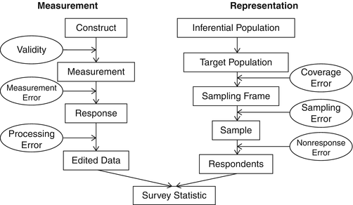

## Themes: evaluating surveys

Background

- What are the goals of the survey?

Survey design

- How were people sampled?
- What information was collected and how?

Total survey error

- Error introduced by the random process of sampling
- Non-sampling errors: nonresponse, measurement error, information bias

# Background

## Survey goals

NIH: "The survey, offered in English and in Spanish, included questions to gauge public interest in the program and to learn about individuals' preferences concerning data collection, data sharing and involvement in various aspects of the program."

Politico: "NIH conducted the survey to help it better design the PMI study, which aims to track 1 million or more U.S. participants."

## Precision Medicine Initiative

- [About: Precision Medicine Initiative](https://ghr.nlm.nih.gov/primer/precisionmedicine/initiative)
- [All of Us Research Program](https://www.nih.gov/research-training/allofus-research-program)

# Total survey error

## Components of total survey error

Total survey error describes all of the possible errors that can affect our estimate of the quantitiy of interest.

[Reference](https://link.springer.com/referenceworkentry/10.1007%2F978-94-007-0753-5_3034)

## Components of total survey error

- Sampling errors: errors in estimates due to not surveying the entire population
    - Related to the inherent variability of what we are trying to measure
- Nonsampling errors: errors in estimates due to all other factors
    - Nonresponse
    - Measurement error
    - Information bias (e.g. self-report, recall)

## Sampling errors

Related to standard error formulas for different estimators:

$$ SE(\hat p) = \sqrt{ \frac{p(1-p)}{n} } $$

$$ SE(\bar X) = \frac{s}{\sqrt n} $$

This is just one aspect of estimation error!

## Response rate

NIH: "The study authors analyzed responses of 2,601 people, selected randomly from a representative sample of the U.S. population."

Politico: "The 2,600-person survey found consistent support across racial and ethnic groups, including demographic groups that have been historically understudied in research."

## Response rate

- Is the number of respondents high enough to represent a spread of demographic variables?
- We know how many people responded to the survey, but we don't know how many people were asked to take the survey. Why is this important?

## Nonresponse rates

How would we judge reliability of the survey results under these two situations?

- 10,000 asked to take the survey. 2,601 respond
- 3,000 asked to take the survey. 2,601 respond

What are some reasons that people would not take the survey?

## Nonresponse bias

Those who don't take the survey could be systematically different from those who do.

Notable example: Literary Digest poll during the 1936 presidential election between Franklin D. Roosevelt and Alf Landon ([Wikipedia](https://en.wikipedia.org/wiki/United_States_presidential_election,_1936#Pre-election_polling))

## Dealing with nonresponse

- Nonresponse seems similar to noncompliance in randomized trials - can we use an instrumental variables approach?
- Statisticians have developed approaches for this: [Wang et al. (2014)](http://www.jstor.org/stable/24310979), [Tchetgen Tchetgen EJ, Wirth KE (2017)](https://www.ncbi.nlm.nih.gov/pubmed/28230909)
- Difficulty is in finding a strong instrument

## Dealing with nonresponse

- Compare covariates of responders and nonresponders
    - Can use census information or work with companies that maintain a database of people "representative" of various populations
    - Often with convenience surveys (e.g. internet surveys), this information is not available.

## Dealing with nonresponse

- Use **multiple imputation** to assess sensitivity of estimates to potential values from nonresponders.
    - Recall: imputation is a statistical technique used to fill in missing values.
    - **Single imputation** guesses one value for each missing value. Does not account for the uncertainty in this filling-in process.
    - **Multiple imputation** proposes multiple values for each missing value. Perform estimation on each of these datasets.

## Dealing with nonresponse

- Plan for this in the design phase
    - For surveys that occur over time or are administered in waves, we can collect demographic information over time. We might assume that those who responded later, after a lot of prodding, are similar to the nonrespondents. ([Armstrong et al. Estimating nonresponse bias in mail surveys](http://www.jstor.org/stable/3150783))
    - Can also use a propensity score-like approach: use logistic regression to model the probability of response given observed covariates and use these "propensity scores" to say that responders with low propensity scores are similar to nonresponders.

## Measurement error and information bias

- Measurement error can be dealt with using statistical techniques that acknowledge this added uncertainty.
    - e.g. mixed effects models treat covariates as random variables rather than fixed quantities when estimating effects of interest.
    - Recall our simulation investigation in module 1: adding noise to the $X$ variable when looking at the relationship between $Y$ and $X$.
- To assess information bias, we would typically need to collect external data in which we know the true measurements or conduct sensitivity analyses to make qualitiative comments about the impact on our estimates.

# Survey Design

## Sampling plan

NIH: "The study authors analyzed responses of 2,601 people, selected randomly from a representative sample of the U.S. population."

What does "selected randomly from a representative sample of the U.S. population" mean? Brainstorm some ideas about how we might actually do this.

How do we obtain a representative sample and select randomly from it?

## Sampling frame

A **sampling frame** is the object that we actually use to draw a sample.

- Phonebook
- Database (such as the US Postal Service's Delivery Sequence File)

If the sampling frame is not representative of the population to which we want to generalize, then we have representation/coverage error.

## Terminology: random sample vs. probability sample

- Don't necessarily need to draw units from these sampling frames with equal probability
    - Called **simple random sampling** or just **random sampling**.
- If we specify/know the probability of drawing each unit into our sample, we have a **probability sample**.
- In a **non-probability sample**, we do not know the probability of selection into the survey.
    - e.g. Convenience, quota, snowball sampling

## Sampling designs

Depending on the nature of the scientific question and the available population, different sampling **procedures** may be used. While a sampling frame gives information on the units available, a sampling design specifies **how** we sample those units.

- Simple random sampling
- Stratified sampling
- Cluster sampling
- Multi-stage sampling

## Simple random sampling

- Every unit in the sampling frame has the same probability of being selected
- Often only used for smaller scale surveys
- e.g. Draw $n$ undergraduates uniformly from a Hopkins database and ask them how many hours they study each week.

## Stratified sampling

- If there are known subgroups of interest, we can ensure that we target them equally by performing sampling within strata
- e.g. Draw $n$ undergraduates uniformly within strata formed by year in school and major and ask them how many hours they study each week
- Variability of estimates within strata can be smaller than with simple random sampling

## Cluster sampling

- Units are groups of individuals or other lower-level units. e.g. states, school districts, schools, classrooms
- Often the sampling frame of individuals is not available or hard to obtain. Cluster sampling can be more realistic to conduct.
    - e.g. Sample physicians rather than the individual patients for privacy reasons
- Correlation between units
    - Nice if the cluster is representative of the target population or is of interest itself
    - Not so nice if cluster represents a niche group

## Multi-stage sampling

- Based on the nature of sampling frames available, it can be more feasible to perform sampling in stages
- Similar to cluster sampling, but we sample units within each cluster
- e.g. [NHANES](https://www.cdc.gov/nchs/nhanes/participant.htm)

## Estimation

- Goals: estimate a mean, total, proportion overall and within subgroups
- Simple approach: calculate the sample mean and sample proportion, use regression
- Better approach: incorporate information from the sampling design in the form of **survey weights**
    - From the previous sampling designs, we know/can calculate the probability of sampling each unit (in a clean situation with no nonresponse).
    - These probabilities give rise to **survey weights**.
    - Weights are related to the inverse probability of being sampled.
    - Weight calculations are also influenced by generalizability considerations (subjectivity!).

## Oversampling and post-stratification

- If we want to get an accurate estimate of a measure within a typically underrepresented subgroup (a stratum), we may want to oversample this group relative to its true proportion in the population.
    - e.g. If patients with a rare disease make up 1% of the population, we won't get a very precise (low variability) estimate of average activity (steps/day) if we let them be 1% of our sample. We must sample them more heavily to get a more accurate and precise estimate.
- Account for oversampling a stratum with **post-stratification weighting**.
    - This requires knowing the true proportions of the subgroups within the population.
    - e.g. census, US Current Population Survey
    - Post-stratification weighting generally describes the process of up- or downweighting units so that the sample more closely resembles the target population.

## Questionnaire design

Let's say we would like to conduct a survey to assess the tendency towards different types of work behaviors among employees at different companies.

We would first need to have an idea of what categories of behaviors exist. For example:

- Self-motivated
- Motivated by income
- Motivated by perks
- Motivated by recognition

We would then use these categories to guide questionnaire design. The questionnaires/materials shown to the survey participants are also called **instruments**.

## Questionnaire design

We then need to evaluate how much our questions truly measure the types of behaviors that we were interested in. This is often referred to as **survey validation**. For example:

- How many days per week do you willingly work from home?
- Do you feel pride in your work?

Sometimes validating the measurement capabilities of a survey is an entire research project itself. Statistical techniques called **latent variable methods** are often used to explore these topics. (Robert DeVellis. Scale Development: Theory and Applications.)

## Materials design

- In general, the materials given to survey participants must be carefully developed so as to avoid creating bias due to language, education, or culture.
- Care must also be taken regarding the wording and ordering of the questions and answer choices provided in case priming or 
- Usually this involves testing the materials in a pilot study.

Were there any parts of these materials that stood out to you?

# Final thoughts

## Representation bias

[Exit Polls, and Why the Primary Was Not Stolen From Bernie Sanders](https://www.nytimes.com/2016/06/28/upshot/exit-polls-and-why-the-primary-was-not-stolen-from-bernie-sanders.html)

- Younger people tend to participate in exit polls and tended to favor Bernie

## Variability in analysis

[We Gave Four Good Pollsters the Same Raw Data. They Had Four Different Results.](https://www.nytimes.com/interactive/2016/09/20/upshot/the-error-the-polling-world-rarely-talks-about.html)

- Weighting to make the sample more representative
    - Variability in source of target population demographic data
    - Variability in what variables should influence the weights
- Which of these pollees will actually vote?
    - Self-reported voting intentions
    - Vote history

## Total survey error

[When You Hear the Margin of Error Is Plus or Minus 3 Percent, Think 7 Instead](https://www.nytimes.com/2016/10/06/upshot/when-you-hear-the-margin-of-error-is-plus-or-minus-3-percent-think-7-instead.html)

- Where does the plus or minus 3% come from?
    - Assuming a simple random sample of 1067 people the maximum half width of the confidence interval is

$$ 1.96 * \sqrt{\frac{0.5(1-0.5)}{1067}} $$

## Survey weighting

[How One 19-Year-Old Illinois Man Is Distorting National Polling Averages](https://www.nytimes.com/2016/10/13/upshot/how-one-19-year-old-illinois-man-is-distorting-national-polling-averages.html)

- Underrepresentation of minority groups in polling panels combined with subjectivity in weighting methods can lead to extreme up- or downweighting of certain individuals

## Generalizability of surveys

- Statistical considerations:
    - Considering the quantity and characteristics of the subjects that took the survey and the analysis of the survey, will the responses generalize to my population of interest?
    - Consider the different aspects of total survey error and how they were addressed
- Implementation considerations:
    - Was there something about the survey itself that influenced respondents to answer in a particular way that doesn't translate to real life?
    - Step into the shoes of the survey taker and anticipate how your responses might not reflect your true state
